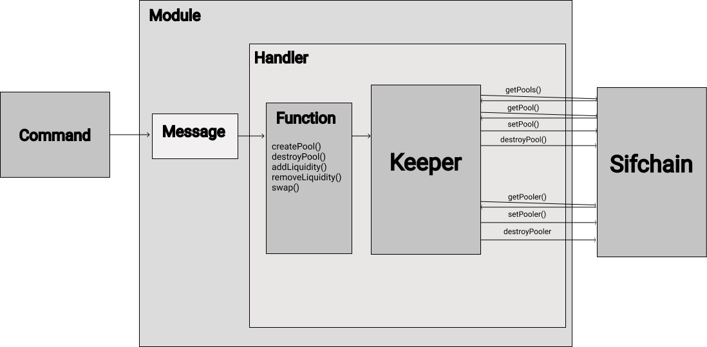
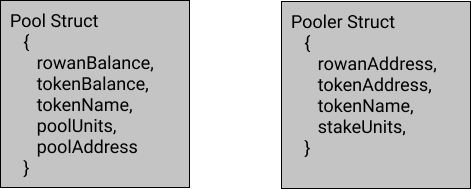
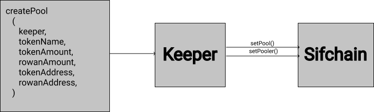
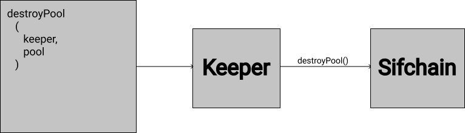
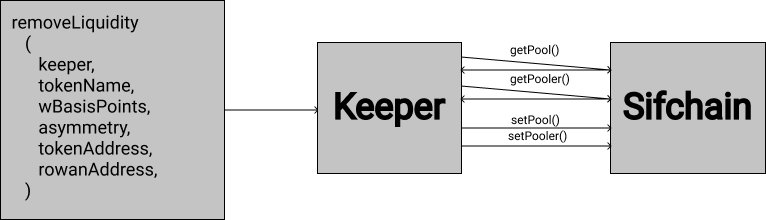
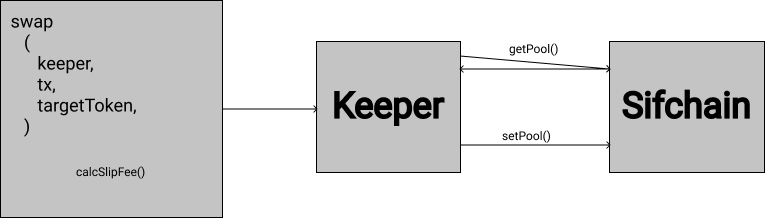

# **Sifchain Liquidity Pools Architecture**

## Changelog
-First Draft: Austin Haines &amp; Charlie Wolf (Barefoot Coders)
 Prepared For: Jazear Brooks, Sifchain  September 21, 2020


## Context
Outlined below are the starting points of an architecture that will allow Sifchain to implement an MVP version of liquidity pools similar to Sushiswap.

## Cosmos-SDK Objects

The following represent objects outlined by the Cosmos-SDK that the software will use to facilitate communication with the rest of the blockchain.

**Module:** Application container housing all liquidity pool logic.

**Context:** Data structure passed between functions containing a copy of the entire state.

**Transaction:** Object created by users that contains metadata for a desired operation. Metadata includes `Contexts` and `Messages`. `Transactions` are stored in the mempool, as they contain a complete set of commands for an operation. The result of a `Transaction`, once fully verified by validators, will be committed and stored on-chain.

**Handler:** Function for processing `Messages` received from outside the liquidity pool `Module`. The `Handler` will receive a `Context`, `Keeper`, and `Message` which will be used to execute the necessary functions for a `Message` ie: `swap()`, `addLiquidity()` etc...

**Message:** Object containing core state changes for a desired operation ie: creating a pool, adding liquidity to a pool, or destroying a pool.

**Query:** Requests by the user for information about the state of the `Module`&#39;s store.

**Querier:** Function for processing store `Query`s defined in the `Module`.

**queryPool(),queryPools(), queryPooler(), queryPoolers()**

**Keeper** : Object that manages external access to the `Module`&#39;s store (a subset of the main chain state) via a store key, and contains any necessary references to external `Module`&#39;s stores (in this case the bank `Module` for updating account balances). Also contains a reference to the `Codec` used to encode/decode structs and interfaces.

**Struct** : 
```golang 
{
  bankKeeper (cosmos-sdk),
  storeKey (cosmos-sdk),
  Codec (cosmos-sdk),
}
```
The `Keeper` also contains methods for getting/setting the store affected by the `Module`. In this `Module` these will be methods for getting, setting, and destroying pools and liquidity stakes on/from the store.

**Functions** :

getPools(), getPool(), setPool(), destroyPool(), getPooler(), setPooler(), destroyPooler()



## Structs

These structures contain all data pertaining to liquidity pools that are stored on-chain. All `Transactions` processed by the liquidity pool `Module` will result in the creation of, destruction of, or changes to these structures stored on-chain.

**Pool** : Contains Rowan and ERC-20 token balances, pool units, and address for a single pool.

**Pooler** : Contains Rowan address, ERC-20 token address, ERC-20 token name, and pooler units.



**Units:** These units are used to represent a `pooler`&#39;s ownership of a `pool`(poolerUnits), and the total ownership of the `pool` (poolUnits). They are used in Thorchain&#39;s CLP model for calculating asymmetric deposits/withdrawals and slip-fee swaps.

>poolerUnits (calculated when liquidity is added) =

>(rowanBalance + tokenBalance) \* (poolerRowan \* tokenBalance + rowanBalance \* poolerToken) /
>(4 \* rowanBalance \* tokenBalance)
>poolUnits = total of all outstanding poolerUnits

## Functions

**createPool()**: Creates a new liquidity pool for specified ERC-20 token.

The creator of the pool contributes tokens and becomes the `pool`&#39;s first `pooler`.


```golang 
{
  create new pool struct
  create new pooler struct
  newPoolUnits, poolerUnits = calculatePoolUnits(0, 0, 0, rowanAmount, tokenAmount)
  set pool units to newPoolUnits
  add rowanAmount to pool rowanBalance
  add tokenAmount to pool tokenBalance
  setPool()
  add poolerUnits to pooler's poolerUnits
  setPooler()
}
```
**calculatePoolUnits(oldPoolUnits, rowanBalance, tokenBalance, rowanAmount, tokenAmount):**
```golang 
{
  R = rowanBalance + rowanAmount, A = tokenBalance + tokenAmount,
  r = rowanAmount, a = tokenAmount
  poolerUnits = ((R + A) \* (r \* A + R \* a))/(4 \* R \* A)
  poolUnits = oldPoolUnits + poolerUnits
  return poolUnits, poolerUnits
}
```
**destroyPool()**: Destroys liquidity pool specified by pool struct.



**addLiquidity()**: Adds liquidity to an asset&#39;s liquidity pool asymmetrically.


```golang 
{
  getPool(tokenName)
  getPooler(tokenName, rowanAddress) if it exists
  newPoolUnits, poolerUnits = calculatePoolUnits(pool.poolUnits, pool.rowanBalance, pool.tokenBalance, rowanAmount, tokenAmount)
  set pool units to newPoolUnits
  add rowanAmount to pool rowanBalance
  add tokenAmount to pool tokenBalance
  setPool()
  add poolerUnits to pooler's poolerUnits
  setPooler()
}
```
**removeLiquidity():** Functions similar to addLiquidity, but uses poolerUnits and poolUnits to determine pooler&#39;s ownership of the pool. Also takes withdraw basis points and asymmetry parameters to determine amount and proportion of token output.

>asymmetry: -1 = 100% Rowan, 0 = 50% Rowan 50% Token, 1 = 100% Token

>wBasisPoints: 0 = 0%, 10000 = 100%


```golang 
{
  getPool(tokenName)
  getPooler(tokenName, rowanAddress) if it exists
  withdrawRowan, withdrawToken, poolerUnitsLeft =
  calculateWithdraw(pool.poolUnits,pool.rowanBalance, pool.tokenBalance, pooler.poolerUnits, wBasisPoints, asymmetry)
  set pool units to pool.poolUnits minus pooler.poolerUnits plus poolerUnitsLeft
  subtract withdrawRowan from pool.rowanBalance
  subtract withdrawToken from pool.tokenBalance
  setPool()
  set pooler.poolerUnits to poolerUnitsLeft
  if pooler units is not zero
    setPooler()
  else
    destroyPooler()
}
```
**calculateWithdraw(poolUnits, rowanBalance, tokenBalance, poolerUnits, wBasisPoints, asymmetry):** Uses asymmetry and basis point values to calculate the final rowan and token withdraw amounts.
```golang 
{
  if asymmetry is negative
    rowanPercent = absoluteValue(asymmetry) +
    absoluteValue(asymmetry)^2
    tokenPercent = 1 - rowanPercent
    rowanBasis = rowanPercent \* wBasisPoints
    tokenBasis = tokenPercent \* wBasisPoints
  else if asymmetry is positive
    tokenPercent = asymmetry + asymmetry^2
    rowanPercent = 1 - rowanPercent
    rowanBasis = rowanPercent \* wBasisPoints
    tokenBasis = tokenPercent \* wBasisPoints
  else if asymmetry is zero
    rowanBasis, tokenBasis = 0.5 \* wBasisPoints
  rowanUnits = poolerUnits / ( 10000 / rowanBasis)
  tokenUnits = poolerUnits / ( 10000 / tokenBasis)
  withdrawRowan = poolRowan / (poolUnits / rowanUnits)
  withdrawToken = poolToken / (poolUnits / tokenUnits)
  poolerUnitsLeft = poolerUnits - (rowanUnits + tokenUnits)
  return withdrawRowan, withdrawToken, poolerUnitsLeft
}
```
**swap()**: Swaps amount of source token for target token from specified token pool.
For swaps between two ERC-20 tokens, this function will be used twice: (ERC-20 to Rowan + Rowan to ERC-20).
Uses Thorchain&#39;s slip based Continuous Liquidity Pool model to calculate trade slip, liquidity fee, and resulting swap.

>x = source token amount, X = source token pool balance, Y = target token pool balance

>Liquidity Fee = ( x^2 \* Y ) / ( x + X )^2

>Trade Slip = x \* (2\*X + x) / (X \* X)

>Swap Result = ( x \* X \* Y ) / ( x + X )^2


```golang
{
  if pool for tokenName exists
    getPool(tx.tokenName)
  if source is Rowan
    X = pool.rowanBalance
    Y = pool.tokenBalance
  else
    Y = pool.rowanBalance
    X = pool.tokenBalance
  x = tx.amount
  liquidityFee = calcLiquidityFee(X, x, Y)
  tradeSlip = calcTradeSlip(X, x)
  swapResult = calcSwapResult(X, x, Y)
  if swapResult >=Y
    fail, “not enough target tokens to swap”
  if source is Rowan
    pool.rowanBalance = X + x
    pool.tokenBalance = Y - swapResult
  else
    pool.tokenBalance = X + x
    pool.rowanBalance = Y - swapResult
  setPool()

  record liquidityFee for use in liquidity rewards
}
```
**calcLiquidityFee(X, x, Y):** calculates liquidity fee per Thorchain's CLP model
```golang
{
  return (x \* x \*Y ) / ((x + X) \* (x + X))
}
```
**calcTradeSlip():** calculates trade slip per Thorchain's CLP model
```golang
{
  return x \* (2 \* X + x) / (X \* X)
}
```
**calcSwapResult():** calculates final swap target token amount
```golang
{
  return ( x \* X \* Y ) / ((x + X) \* (x + X))
}
```
**NOTE:** Thorchain also implements a &quot;swap queue&quot; model to process and order swaps based on fee and slip size. I&#39;m not sure if this component would be necessary for an MVP, but I can also outline it if desired.
