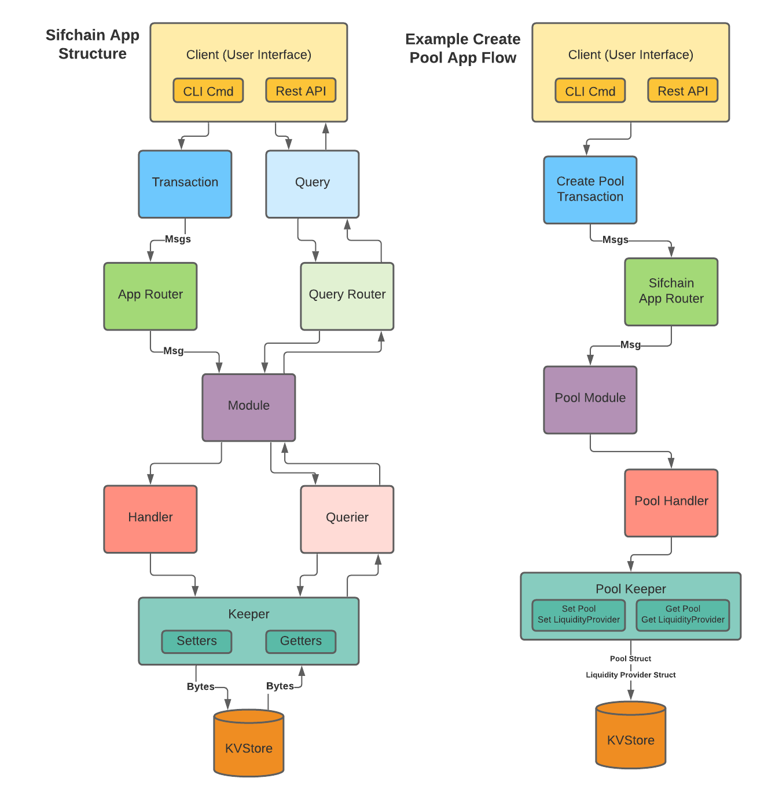

# **Sifchain Liquidity Pools Architecture**

## Changelog
-First Draft: Austin Haines &amp; Charlie Wolf (Barefoot Coders)
 Prepared For: Jazear Brooks, Sifchain  September 21, 2020

-First Revision: Austin Haines (Barefoot Coders) September 28, 2020


## Context
Outlined below are the starting points of an architecture that will allow Sifchain to implement an MVP version of liquidity pools similar to Sushiswap.

## Cosmos-SDK Objects

The following represent objects outlined by the Cosmos-SDK that the software will use to facilitate communication with the rest of the blockchain.

**Module:** Application container housing all liquidity pool logic.

**Context:** Data structure passed between functions containing a copy of the entire state.

**Transaction:** Object created by users that contains metadata for a desired operation. Metadata includes `Contexts` and `Messages`. `Transactions` are stored in the mempool, as they contain a complete set of commands for an operation. The result of a `Transaction`, once fully verified by validators, will be committed and stored on-chain.

**Handler:** Function for processing `Messages` received from outside the liquidity pool `Module`. The `Handler` will receive a `Context`, `Keeper`, and `Message` which will be used to execute the necessary functions for a `Message` ie: `swap()`, `addLiquidity()` etc...

**Message:** Object containing core state changes for a desired operation ie: creating a pool, adding liquidity to a pool, or destroying a pool.

**Event:** Object containing metadata relevant to messages. Returned by a module to the base app and recorded on-chain for block explorers and other services to track.

**Event Handler:** Abstraction responsible for processing and maintaining a list of `Events` for a `Transaction`.

**Query:** Requests by the user for information about the state of the `Module`&#39;s store.

**Querier:** Function for processing store `Query`s defined in the `Module`.

**queryPool(),queryPools(), queryPooler(), queryPoolers()**

**Keeper** : Object that manages external access to the `Module`&#39;s store (a subset of the main chain state) via a store key, and contains any necessary references to external `Module`&#39;s stores (in this case the bank `Module` for updating account balances). Also contains a reference to the `Codec` used to encode/decode structs and interfaces.

**Struct** : 
```golang 
{
  bankKeeper (cosmos-sdk),
  storeKey (cosmos-sdk),
  Codec (cosmos-sdk),
}
```
The `Keeper` also contains methods for getting/setting the store affected by the `Module`. In this `Module` these will be methods for getting, setting, and destroying pools and liquidity stakes on/from the store.

**Functions** :

getPools(), getPool(), setPool(), destroyPool(), getLiquidityProvider(), setLiquidityProvider(), destroyLiquidityProvider()



## Structs

These structures contain all data pertaining to liquidity pools that are stored on-chain. All `Transactions` processed by the liquidity pool `Module` will result in the creation of, destruction of, or changes to these structures stored on-chain.

**Pool** : Contains native and asset token balances, pool units, and address for a single pool.

**LiquidityProvider** : Contains `Asset` structure, liquidity provider units, and liquidity provider address.

**Asset** : Contains chain, symbol and ticker identifying a single asset.


**Units:** These units are used to represent a `LiquidityProvider`&#39;s ownership of a `Pool` (lpUnits), and the total ownership of the `Pool` (poolUnits). They are used in Thorchain&#39;s CLP model for calculating asymmetric deposits/withdrawals and slip-fee swaps.

>lpUnits (calculated when liquidity is added) =

>(nativeBalance + assetBalance) * (lpNative * assetBalance + nativeBalance * lpAsset) /
>(4 * nativeBalance * assetBalance)
>poolUnits = total of all outstanding lpUnits

## Functions

**createPool(keeper, asset, assetAmount, nativeAmount)**: Creates a new liquidity pool for specified asset.

The creator of the pool contributes tokens and becomes the `Pool`&#39;s first `LiquidityProvider`.

```golang 
{
  if total amount is below minimum threshold
    fail
  create new Pool struct
  create new LiquidityProvider struct
  newPoolUnits, lpUnits = calculatePoolUnits(0, 0, 0, nativeAmount, assetAmount)
  set pool units to newPoolUnits
  add nativeAmount to pool nativeBalance
  add assetAmount to pool assetBalance
  setPool()
  add lpUnits to liquidityprovider lpUnits
  setLiquidityProvider()
}
```
**calculatePoolUnits(oldPoolUnits, nativeBalance, assetBalance, nativeAmount, assetAmount):**
```golang 
{
  R = nativeBalance + nativeAmount, A = assetBalance + assetAmount,
  r = nativeAmount, a = assetAmount
  poolerUnits = ((R + A) * (r * A + R * a))/(4 * R * A)
  poolUnits = oldPoolUnits + lpUnits
  return poolUnits, lpUnits
}
```


**destroyPool(keeper, asset)**: Destroys liquidity pool specified by asset.

**addLiquidity(keeper, asset, assetAmount, nativeAmount)**: Adds liquidity to an asset&#39;s liquidity pool asymmetrically.

```golang 
{
  getPool(asset)
  getLiquidityProvider(lpAddress) if it exists
  newPoolUnits, lpUnits = calculatePoolUnits(pool.poolUnits, pool.nativeBalance, pool.assetBalance, nativeAmount, assetAmount)
  set pool units to newPoolUnits
  add nativeAmount to pool nativeBalance
  add lpUnits to pool assetBalance
  setPool()
  add lpUnits to liquidityprovider lpUnits
  setLiquidityProvider()
}
```


**removeLiquidity(keeper, asset, wBasisPoints, asymmetry):** Functions similar to addLiquidity, but uses lpUnits and poolUnits to determine `LiquidityProvider`&#39;s ownership of the `Pool`. Also takes withdraw basis points and asymmetry parameters to determine amount and proportion of token output.

>asymmetry: -1 = 100% Native, 0 = 50% Native 50% Asset, 1 = 100% Asset

>wBasisPoints: 0 = 0%, 10000 = 100%

```golang 
{
  getPool(asset)
  getLiquidityProvider(lpAddress) if it exists
  withdrawNative, withdrawAsset, lpUnitsLeft =
  calculateWithdraw(pool.poolUnits,pool.nativeBalance, pool.assetBalance, liquidityprovider.lpUnits, wBasisPoints, asymmetry)
  set pool units to pool.poolUnits minus liquidityprovider.lpUnits plus lpUnitsLeft
  subtract withdrawNative from pool.nativeBalance
  subtract withdrawAsset from pool.assetBalance
  setPool()
  set liquidityprovider.lpUnits to lpUnitsLeft
  if liquidityprovider lpUnits is not zero
    setLiquidityProvider()
  else
    destroyLiquidityProvider()
}
```
**calculateWithdraw(poolUnits, nativeBalance, assetBalance, lpUnits, wBasisPoints, asymmetry):** Uses asymmetry and basis point values to calculate the final native and asset withdraw amounts.
```golang 
{
  if asymmetry is negative
    nativePercent = absoluteValue(asymmetry) +
    absoluteValue(asymmetry)^2
    assetPercent = 1 - nativePercent
    nativeBasis = nativePercent * wBasisPoints
    assetBasis = assetPercent * wBasisPoints
  else if asymmetry is positive
    assetPercent = asymmetry + asymmetry^2
    nativePercent = 1 - assetPercent
    nativeBasis = nativePercent * wBasisPoints
    assetBasis = assetPercent * wBasisPoints
  else if asymmetry is zero
    nativeBasis, assetBasis = 0.5 * wBasisPoints
  nativeUnits = lpUnits / ( 10000 / nativeBasis)
  assetUnits = lpUnits / ( 10000 / assetBasis)
  withdrawNative = poolNative / (poolUnits / nativeUnits)
  withdrawAsset = poolAsset / (poolUnits / assetUnits)
  lpUnitsLeft = lpUnits - (nativeUnits + assetUnits)
  return withdrawNative, withdrawAsset, lpUnitsLeft
}
```


**swap(keeper, sourceAsset, targetAsset sourceAmount)**: Swaps amount of source asset for target asset. Calls swapOne to do actual swap work.  If source asset and target asset are both non-native swapOne is called twice: (Asset to Native + Native to Asset).
```golang
{
  if is double swap
    emitAmount = swapOne(keeper, sourceAsset, sourceAmount, native)
  swapOne(keeper, native, emitAmount, targetAsset)
}
```
**swapOne(keeper, asset, sourceAmount, targetAsset)**: Swaps amount of source asset for target asset from specified asset pool.

Uses Thorchain&#39;s slip based Continuous Liquidity Pool model to calculate trade slip, liquidity fee, and resulting swap.

>x = source asset amount, X = source asset pool balance, Y = target asset pool balance

>Liquidity Fee = ( x^2 * Y ) / ( x + X )^2

>Trade Slip = x * (2*X + x) / (X * X)

>Swap Result = ( x * X * Y ) / ( x + X )^2

```golang
{
  if pool for asset exists
    getPool(asset)
  if targetAsset is native
    Y = pool.nativeBalance
    X = pool.assetBalance
  else
    X = pool.nativeBalance
    Y = pool.assetBalance
  x = sourceAmount
  liquidityFee = calcLiquidityFee(X, x, Y)
  tradeSlip = calcTradeSlip(X, x)
  swapResult = calcSwapResult(X, x, Y)
  if swapResult >=Y
    fail, “not enough target asset tokens to swap”
  if source is native
    pool.nativeBalance = X + x
    pool.assetBalance = Y - swapResult
  else
    pool.assetBalance = X + x
    pool.nativeBalance = Y - swapResult
  setPool()

  record liquidityFee for use in liquidity rewards
  return emitAmount
}
```
**calcLiquidityFee(X, x, Y):** calculates liquidity fee per Thorchain's CLP model
```golang
{
  return (x * x * Y ) / ((x + X) * (x + X))
}
```
**calcTradeSlip(X, x):** calculates trade slip per Thorchain's CLP model
```golang
{
  return x * (2 * X + x) / (X * X)
}
```
**calcSwapResult(X, x, Y):** calculates final swap target token amount
```golang
{
  return ( x * X * Y ) / ((x + X) * (x + X))
}
```


**Swap Queue:** TODO
