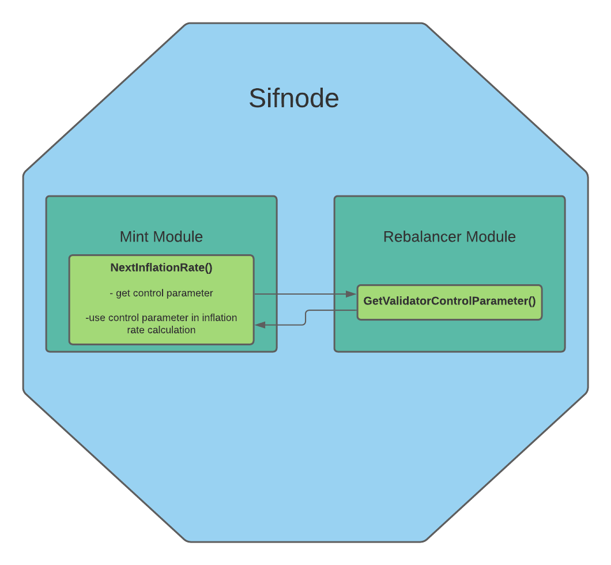

# **Sifchain Minting Module**

## Changelog
-First Draft: Austin Haines


## Context
The module outlined below is necessary for Sifchain's Dynamic Reward Rebalancing Policy.  The module will control the magnitude of rewards minted by Sifchain's validator system based on the Rebalancing Policy's control parameter. This module will wrap the Cosmos-SDK mint module, hook in the Rebalincing Policy's control parameter, and account for the control parameter in inflation rate calculations. This method will require the least changes to Cosmos' existing minting system.

## Cosmos-SDK Wrapped Mint Module

In order to wrap the Cosmos-SDK mint module, we create a new module, import the Cosmos-SDK mint module, redefine the functions that need to be changed, and import this new module into Sifchain.



The wrapped module will have the following structure:

    -x/
        -mint/
            -internal/types/
                -minter.go
                -expected_keepers.go
            -alias.go
            -cosmos_alias.go
            -module.go


**minter.go** The minter type is where we retrieve and use our Rebalancing control parameter in the NextInflationRate() function. Everything else is unchanged from Cosmos' mint module.

```golang
package types

import (
	"fmt"

	sdk "github.com/cosmos/cosmos-sdk/types"
)

// Minter represents the minting state.
type Minter struct {
	Inflation        sdk.Dec `json:"inflation" yaml:"inflation"`                 // current annual inflation rate
	AnnualProvisions sdk.Dec `json:"annual_provisions" yaml:"annual_provisions"` // current annual expected provisions
}

// NewMinter returns a new Minter object with the given inflation and annual
// provisions values.
func NewMinter(inflation, annualProvisions sdk.Dec) Minter {
	return Minter{
		Inflation:        inflation,
		AnnualProvisions: annualProvisions,
	}
}

// InitialMinter returns an initial Minter object with a given inflation value.
func InitialMinter(inflation sdk.Dec) Minter {
	return NewMinter(
		inflation,
		sdk.NewDec(0),
	)
}

// DefaultInitialMinter returns a default initial Minter object for a new chain
// which uses an inflation rate of 13%.
func DefaultInitialMinter() Minter {
	return InitialMinter(
		sdk.NewDecWithPrec(13, 2),
	)
}

// validate minter
func ValidateMinter(minter Minter) error {
	if minter.Inflation.IsNegative() {
		return fmt.Errorf("mint parameter Inflation should be positive, is %s",
			minter.Inflation.String())
	}
	return nil
}

// NextInflationRate returns the new inflation rate for the next hour.
func (m Minter) NextInflationRate(params Params, bondedRatio sdk.Dec) sdk.Dec {
	// The target annual inflation rate is recalculated for each previsions cycle. The
	// inflation is also subject to a rate change (positive or negative) depending on
	// the distance from the desired ratio (67%). The maximum rate change possible is
	// defined to be 13% per year, however the annual inflation is capped as between
	// 7% and 20%.
    controlParameter = RebalancerKeeper.GetValidatorControlParameter()
	// (1 - bondedRatio/GoalBonded) * InflationRateChange
	inflationRateChangePerYear := sdk.OneDec().
		Sub(bondedRatio.Quo(params.GoalBonded)).
        Mul(params.InflationRateChange)
    // Apply control over updated interest rate.
	inflationRateChange := controlParameter.Mul(inflationRateChangePerYear.Quo(sdk.NewDec(int64(params.BlocksPerYear))))

	// adjust the new annual inflation for this next cycle
	inflation := m.Inflation.Add(inflationRateChange) // note inflationRateChange may be negative
	if inflation.GT(params.InflationMax) {
		inflation = params.InflationMax
	}
	if inflation.LT(params.InflationMin) {
		inflation = params.InflationMin
	}

	return inflation
}

// NextAnnualProvisions returns the annual provisions based on current total
// supply and inflation rate.
func (m Minter) NextAnnualProvisions(_ Params, totalSupply sdk.Int) sdk.Dec {
	return m.Inflation.MulInt(totalSupply)
}

// BlockProvision returns the provisions for a block based on the annual
// provisions rate.
func (m Minter) BlockProvision(params Params) sdk.Coin {
	provisionAmt := m.AnnualProvisions.QuoInt(sdk.NewInt(int64(params.BlocksPerYear)))
	return sdk.NewCoin(params.MintDenom, provisionAmt.TruncateInt())
}
```

**expected_keepers.go** Here we import the Rebalancer module to get access to the control parameter.

```golang
package types // noalias

import (
	sdk "github.com/cosmos/cosmos-sdk/types"
	"github.com/cosmos/cosmos-sdk/x/supply/exported"
)

// StakingKeeper defines the expected staking keeper
type StakingKeeper interface {
	StakingTokenSupply(ctx sdk.Context) sdk.Int
	BondedRatio(ctx sdk.Context) sdk.Dec
}

// SupplyKeeper defines the expected supply keeper
type SupplyKeeper interface {
	GetModuleAddress(name string) sdk.AccAddress

	// TODO remove with genesis 2-phases refactor https://github.com/cosmos/cosmos-sdk/issues/2862
	SetModuleAccount(sdk.Context, exported.ModuleAccountI)

	SendCoinsFromModuleToAccount(ctx sdk.Context, senderModule string, recipientAddr sdk.AccAddress, amt sdk.Coins) error
	SendCoinsFromModuleToModule(ctx sdk.Context, senderModule, recipientModule string, amt sdk.Coins) error
	MintCoins(ctx sdk.Context, name string, amt sdk.Coins) error
}

type RebalancerKeeper interface {
    GetValidatorControlParameter() sdk.Dec
}
```

**alias.go**
```golang
package mint

import (
	"github.com/sifchain/sifnode/x/mint/internal/types"
)

type (
	Minter       = types.Minter   // Create alias to our custom Minter type
)
```

**cosmos_alias.go** Here we create new aliases to unchanged Cosmos mint module types and keepers.

```golang
package mint

// nolint

import (
	"github.com/cosmos/cosmos-sdk/x/mint/internal/keeper"
	"github.com/cosmos/cosmos-sdk/x/mint/internal/types"
)

const (
	ModuleName            = types.ModuleName
	DefaultParamspace     = types.DefaultParamspace
	StoreKey              = types.StoreKey
	QuerierRoute          = types.QuerierRoute
	QueryParameters       = types.QueryParameters
	QueryInflation        = types.QueryInflation
	QueryAnnualProvisions = types.QueryAnnualProvisions
)

var (
	// functions aliases
	NewKeeper            = keeper.NewKeeper
	NewQuerier           = keeper.NewQuerier
	NewGenesisState      = types.NewGenesisState
	DefaultGenesisState  = types.DefaultGenesisState
	ValidateGenesis      = types.ValidateGenesis
	NewMinter            = types.NewMinter
	InitialMinter        = types.InitialMinter
	DefaultInitialMinter = types.DefaultInitialMinter
	ValidateMinter       = types.ValidateMinter
	ParamKeyTable        = types.ParamKeyTable
	NewParams            = types.NewParams
	DefaultParams        = types.DefaultParams

	// variable aliases
	ModuleCdc              = types.ModuleCdc
	MinterKey              = types.MinterKey
	KeyMintDenom           = types.KeyMintDenom
	KeyInflationRateChange = types.KeyInflationRateChange
	KeyInflationMax        = types.KeyInflationMax
	KeyInflationMin        = types.KeyInflationMin
	KeyGoalBonded          = types.KeyGoalBonded
	KeyBlocksPerYear       = types.KeyBlocksPerYear
)

type (
	Keeper       = keeper.Keeper
	GenesisState = types.GenesisState
	// Minter       = types.Minter    Here we exclude the Cosmos SDK Minter type because we are replacing it.
	Params       = types.Params
)
```

**module.go** Here we add types.RebalancerKeeper to the AppModule

```golang
package mint

import (
	"encoding/json"
	"fmt"
	"math/rand"

	"github.com/gorilla/mux"
	"github.com/spf13/cobra"

	abci "github.com/tendermint/tendermint/abci/types"

	"github.com/cosmos/cosmos-sdk/client/context"
	"github.com/cosmos/cosmos-sdk/codec"
	sdk "github.com/cosmos/cosmos-sdk/types"
	"github.com/cosmos/cosmos-sdk/types/module"
	"github.com/cosmos/cosmos-sdk/x/mint/client/cli"
	"github.com/cosmos/cosmos-sdk/x/mint/client/rest"
	"github.com/cosmos/cosmos-sdk/x/mint/simulation"
    sim "github.com/cosmos/cosmos-sdk/x/simulation"
    
    "github.com/sifchain/sifnode/x/mint/internal/types"  // Here we import our custom mint types
)

var (
	_ module.AppModule           = AppModule{}
	_ module.AppModuleBasic      = AppModuleBasic{}
	_ module.AppModuleSimulation = AppModule{}
)

// AppModuleBasic defines the basic application module used by the mint module.
type AppModuleBasic struct{}

var _ module.AppModuleBasic = AppModuleBasic{}

// Name returns the mint module's name.
func (AppModuleBasic) Name() string {
	return ModuleName
}

// RegisterCodec registers the mint module's types for the given codec.
func (AppModuleBasic) RegisterCodec(cdc *codec.Codec) {}

// DefaultGenesis returns default genesis state as raw bytes for the mint
// module.
func (AppModuleBasic) DefaultGenesis() json.RawMessage {
	return ModuleCdc.MustMarshalJSON(DefaultGenesisState())
}

// ValidateGenesis performs genesis state validation for the mint module.
func (AppModuleBasic) ValidateGenesis(bz json.RawMessage) error {
	var data GenesisState
	if err := ModuleCdc.UnmarshalJSON(bz, &data); err != nil {
		return fmt.Errorf("failed to unmarshal %s genesis state: %w", ModuleName, err)
	}

	return ValidateGenesis(data)
}

// RegisterRESTRoutes registers the REST routes for the mint module.
func (AppModuleBasic) RegisterRESTRoutes(ctx context.CLIContext, rtr *mux.Router) {
	rest.RegisterRoutes(ctx, rtr)
}

// GetTxCmd returns no root tx command for the mint module.
func (AppModuleBasic) GetTxCmd(_ *codec.Codec) *cobra.Command { return nil }

// GetQueryCmd returns the root query command for the mint module.
func (AppModuleBasic) GetQueryCmd(cdc *codec.Codec) *cobra.Command {
	return cli.GetQueryCmd(cdc)
}

//____________________________________________________________________________

// AppModule implements an application module for the mint module.
type AppModule struct {
	AppModuleBasic

	keeper Keeper
}

// NewAppModule creates a new AppModule object
func NewAppModule(keeper Keeper, rebalancerKeeper types.RebalancerKeeper) AppModule {   // Here we add the Rebalancer Keeper to our AppModule
	return AppModule{
		AppModuleBasic: AppModuleBasic{},
		keeper:         keeper,
	}
}

// Name returns the mint module's name.
func (AppModule) Name() string {
	return ModuleName
}

// RegisterInvariants registers the mint module invariants.
func (am AppModule) RegisterInvariants(_ sdk.InvariantRegistry) {}

// Route returns the message routing key for the mint module.
func (AppModule) Route() string { return "" }

// NewHandler returns an sdk.Handler for the mint module.
func (am AppModule) NewHandler() sdk.Handler { return nil }

// QuerierRoute returns the mint module's querier route name.
func (AppModule) QuerierRoute() string {
	return QuerierRoute
}

// NewQuerierHandler returns the mint module sdk.Querier.
func (am AppModule) NewQuerierHandler() sdk.Querier {
	return NewQuerier(am.keeper)
}

// InitGenesis performs genesis initialization for the mint module. It returns
// no validator updates.
func (am AppModule) InitGenesis(ctx sdk.Context, data json.RawMessage) []abci.ValidatorUpdate {
	var genesisState GenesisState
	ModuleCdc.MustUnmarshalJSON(data, &genesisState)
	InitGenesis(ctx, am.keeper, genesisState)
	return []abci.ValidatorUpdate{}
}

// ExportGenesis returns the exported genesis state as raw bytes for the mint
// module.
func (am AppModule) ExportGenesis(ctx sdk.Context) json.RawMessage {
	gs := ExportGenesis(ctx, am.keeper)
	return ModuleCdc.MustMarshalJSON(gs)
}

// BeginBlock returns the begin blocker for the mint module.
func (am AppModule) BeginBlock(ctx sdk.Context, _ abci.RequestBeginBlock) {
	BeginBlocker(ctx, am.keeper)
}

// EndBlock returns the end blocker for the mint module. It returns no validator
// updates.
func (AppModule) EndBlock(_ sdk.Context, _ abci.RequestEndBlock) []abci.ValidatorUpdate {
	return []abci.ValidatorUpdate{}
}

//____________________________________________________________________________

// AppModuleSimulation functions

// GenerateGenesisState creates a randomized GenState of the mint module.
func (AppModule) GenerateGenesisState(simState *module.SimulationState) {
	simulation.RandomizedGenState(simState)
}

// ProposalContents doesn't return any content functions for governance proposals.
func (AppModule) ProposalContents(_ module.SimulationState) []sim.WeightedProposalContent {
	return nil
}

// RandomizedParams creates randomized mint param changes for the simulator.
func (AppModule) RandomizedParams(r *rand.Rand) []sim.ParamChange {
	return simulation.ParamChanges(r)
}

// RegisterStoreDecoder registers a decoder for mint module's types.
func (AppModule) RegisterStoreDecoder(sdr sdk.StoreDecoderRegistry) {
	sdr[StoreKey] = simulation.DecodeStore
}

// WeightedOperations doesn't return any mint module operation.
func (AppModule) WeightedOperations(_ module.SimulationState) []sim.WeightedOperation {
	return nil
}
```

