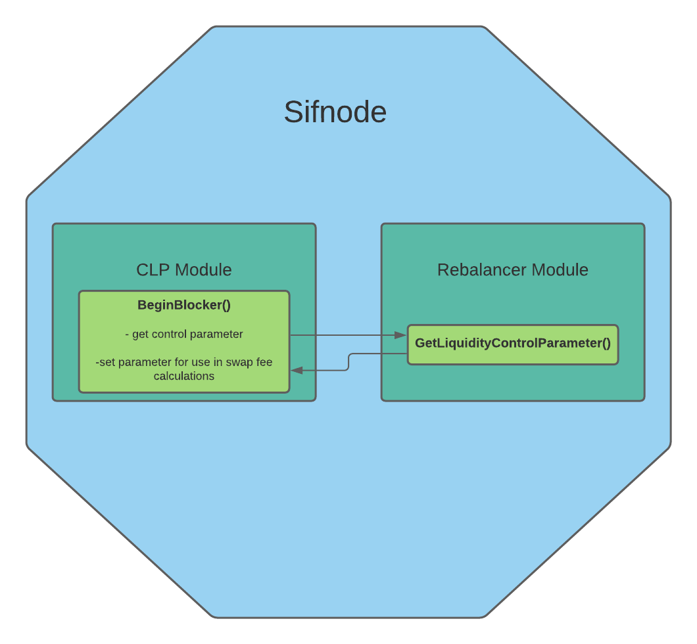

# **Sifchain Rebalancing Policy: CLP Module Changes**

## Changelog
-First Draft: Austin Haines


## Context
This document covers the changes required in Sifchain's Liquidity Pool module to implement Blockscience's proposed Dynamic Rebalancing Policy outlined here: https://hackmd.io/@shrutiappiah/SyuL8Z9rv#Sifchain-System-Income. 

The goal of these changes is to hook the CLP module into the Rebalancer module, retrieve the new Liquidity Control Parameter, and utilize it in existing swap fee calculations. The changes also include a new keeper function allowing the Rebalancer module to retrieve the observed supply of Rowan locked in liquidity pools for use in its own calculations.



## Liquidity Control Parameter

`Param`: LiquidityControlParam  `Type`: sdk.Dec  `Default`: 1.0  `Range`: 0.0 - 1.0

This new parameter is retrieved from the Rebalancer module and incorporated into swap fee calculations. The parameter's value ranges from 0.0 to 1.0 with 0.0 resulting in swap fees of 0 and 1.0 resulting in unaltered swap fees. The default starting value for this parameter is set to 1.0 in order to start the system with an unaltered swap fee.

## Rebalancer Keeper

The Rebalancer module's keeper must be added to CLP's expected keepers and module.go to allow CLP to retrieve the Liquidity Control Parameter.

**expected_keepers.go**
```golang
type RebalancerKeeper interface {
    GetValidatorControlParameter() sdk.Dec
}
```

**module.go**
```golang
// NewAppModule creates a new AppModule object
func NewAppModule(k keeper.Keeper, bankKeeper types.BankKeeper, rebalancerKeeper types.RebalancerKeeper) AppModule {
	return AppModule{
		AppModuleBasic:   AppModuleBasic{},
		keeper:           k,
		bankKeeper:       bankKeeper,
        rebalancerKeeper: rebalancerKeeper,
	}
}
```

## BeginBlocker

The Liquidity Control Parameter must be retrieved from the Rebalancer module every block for use in swap fee calculations. In BeginBlocker we retrieve the parameter and set it to the CLP param store.

**abci.go**
```golang
package clp

import (
	sdk "github.com/cosmos/cosmos-sdk/types"
    abci "github.com/tendermint/tendermint/abci/types"
    "github.com/Sifchain/sifnode/x/clp/types"
)

func BeginBlocker(ctx sdk.Context, req abci.RequestBeginBlock, k Keeper) {
    params := k.GetParams(ctx)
	// Retrieve and set the Liquidity Control Parameter from the Rebalancer module
	params.LiquidityControlParam = rebalancerKeeper.GetLiquidityControlParameter()
    k.SetParams(ctx, params)
}
```

## Calculation Function Updates

The following are changes to existing functions responsible for calculating values associated with swap fees. The changes serve to incorporate the new Liquidity Control Parameter.

**calcLiquidityFee**

```golang
// Updated formula with control parameter:
// fee = controlparam * (m*S_l)/(m+M_l) * (1 - M_l / (m + M_l))
// m   = sentAmount
// M_l = sent Asset Liquidity Pool Balance
// S_l = to Asset Liquidity Pool Balance
func calcLiquidityFee(M_l, m, S_l sdk.Uint, LiquidityControlParam sdk.Dec) sdk.Uint {

    M_total := m.Add(M_l)

    fee := M_l.Quo(M_total)

    fee = sdk.NewDec(1).Sub(fee)

    fee = LiquidityControlParam.Mul(m).Mul(S_l).Quo(M_total).Mul(fee)

    return fee
}
```

**calcSwapResult**

```golang
// Updated formula with control parameter:
// result = (1 - controlparam) * (m*S_l)/(m+M_l) + controlparam * (m*S_l*M_l) / (m + M_l)^2
// m   = sentAmount
// M_l = sent Asset Liquidity Pool Balance
// S_l = to Asset Liquidity Pool Balance
func calcSwapResult((M_l, m, S_l sdk.Uint, LiquidityControlParam sdk.Dec) sdk.Uint {
    M_total := m.Add(M_l)

    term1 := sdk.NewDec(1).Sub(LiquidityControlParam).Mul(m).Mul(S_l)
    term1 = term1.Quo(M_total)

    term2 := LiquidityControlParam.Mul(m).Mul(S_l).Mul(M_l)
    term2 = term2.Quo(M_total.Mul(M_total))

    return term1.Add(term2)
}
```

**calcTradeSlip**

```golang
// price_before = S_l/M_l                                                                  (no slip, no fee)
// swap_result = (1-controlparam)*(m*S_l)/(m+M_l) + controlparam*(m*S_l*M_l) / (m+M_l)^2   (slip + fee)
// slip = (price_before-swap_result)/price_before
//
func calcTradeSlip(X, Y, swapResult sdk.Uint) sdk.Uint {
    p_b := S_l.Quo(M_l)
    
    slip := p_b.Sub(swapResult).Quo(p_b)

	return slip
}
```

**SwapOne**

```golang
// Pass through control parameter, change calc function call order and pass swapResult to calcTradeSlip
func SwapOne(from Asset, sentAmount sdk.Uint, to Asset, pool Pool, LiquidityControlParam sdk.Dec) (sdk.Uint, sdk.Uint, sdk.Uint, Pool, error) {  // Changes here

	var X sdk.Uint
	var Y sdk.Uint

	if to == GetSettlementAsset() {
		Y = pool.NativeAssetBalance
		X = pool.ExternalAssetBalance
	} else {
		X = pool.NativeAssetBalance
		Y = pool.ExternalAssetBalance
	}
	x := sentAmount
    liquidityFee := calcLiquidityFee(X, x, Y, LiquidityControlParam)           // Changes here
    swapResult := calcSwapResult(X, x, Y, LiquidityControlParam)               // Changes here
	tradeSlip := calcTradeSlip(X, Y, swapResult)                               // Changes here
	if swapResult.GTE(Y) {
		return sdk.ZeroUint(), sdk.ZeroUint(), sdk.ZeroUint(), Pool{}, types.ErrNotEnoughAssetTokens
	}
	if from == GetSettlementAsset() {
		pool.NativeAssetBalance = X.Add(x)
		pool.ExternalAssetBalance = Y.Sub(swapResult)
	} else {
		pool.ExternalAssetBalance = X.Add(x)
		pool.NativeAssetBalance = Y.Sub(swapResult)
	}

	return swapResult, liquidityFee, tradeSlip, pool, nil
}
```

All calls to SwapOne must be updated to pass in the Liquidity Control Parameter. 

For example in handleMsgSwap: 
```golang
emitAmount, lp, ts, finalPool, err := SwapOne(sentAsset, sentAmount, nativeAsset, inPool, keeper.GetParams(ctx).LiquidityPoolThreshold)
```

## Keeper Function

The Rebalancer module needs access to the observed supply of Rowan locked in liquidity pools for its calculations. This keeper funtion will calculate and return the observed supply.

```golang
func (k Keeper) GetLiquiditySupply(ctx sdk.Context) sdk.Uint {
   	var supply = sdk.ZeroUint()
	iterator := k.GetPoolsIterator(ctx)
	defer iterator.Close()
	for ; iterator.Valid(); iterator.Next() {
		var pool types.Pool
		bytesValue := iterator.Value()
		k.cdc.MustUnmarshalBinaryBare(bytesValue, &pool)

        supply := supply.Add(pool.NativeAssetBalance)
	}
	return supply
}
```

