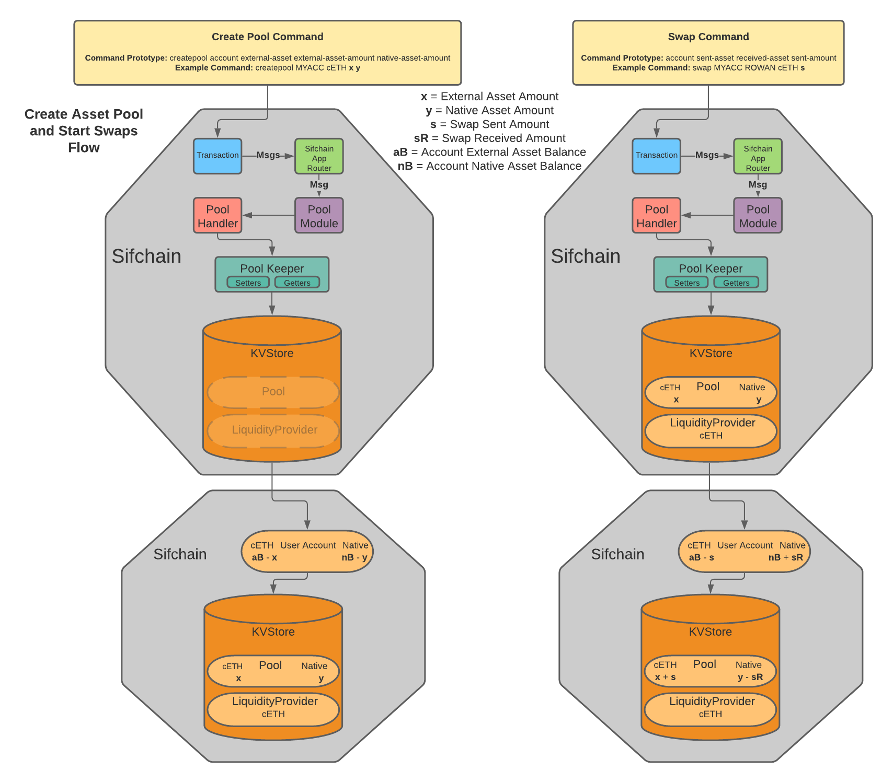

# **Sifchain Liquidity Pools Architecture**

## Changelog
-First Draft: Austin Haines &amp; Charlie Wolf (Barefoot Coders)
 Prepared For: Jazear Brooks, Sifchain  September 21, 2020

-First Revision: Austin Haines (Barefoot Coders) September 28, 2020

-Second Revision: Austin Haines (Barefoot Coders) September 29, 2020

-Third Revision: Austin Haines (Barefoot Coders) October 1, 2020

-Fourth Revision: Austin Haines (Barefoot Coders) January 11, 2021


## Context
Outlined below are the starting points of an architecture that will allow Sifchain to implement an MVP version of liquidity pools similar to Sushiswap.

## Cosmos-SDK Objects

The following represent objects outlined by the Cosmos-SDK that the software will use to facilitate communication with the rest of the blockchain.

**Module:** Application container housing all liquidity pool logic.

**Context:** Data structure passed between functions containing a copy of the entire state.

**Transaction:** Object created by users that contains metadata for a desired operation. Metadata includes `Contexts` and `Messages`. `Transactions` are stored in the mempool, as they contain a complete set of commands for an operation. The result of a `Transaction`, once fully verified by validators, will be committed and stored on-chain.

**Handler:** Function for processing `Messages` received from outside the liquidity pool `Module`. The `Handler` will receive a `Context`, `Keeper`, and `Message` which will be used to execute the necessary functions for a `Message` ie: `swap()`, `addLiquidity()` etc...

**Message:** Object containing core state changes for a desired operation ie: creating a pool, adding liquidity to a pool, or destroying a pool.


**Event:** Object containing metadata relevant to messages. Returned by a module to the base app and recorded on-chain for block explorers and other services to track.

**Event Handler:** Abstraction responsible for processing and maintaining a list of `Events` for a `Transaction`.


**Query:** Requests by the user for information about the state of the `Module`&#39;s store.

**Querier:** Function for processing store `Query`s defined in the `Module`.

**queryPool(),queryPools(), queryliquidityProvider(), queryliquidityProvider()**

**Keeper:** Object that manages external access to the `Module`&#39;s store (a subset of the main chain state) via a store key, and contains any necessary references to external `Module`&#39;s stores (in this case the bank `Module` for updating account balances). Also contains a reference to the `Codec` used to encode/decode structs and interfaces.

**Struct:** 
```golang 
{
  bankKeeper (cosmos-sdk),
  storeKey (cosmos-sdk),
  Codec (cosmos-sdk),
}
```
The `Keeper` also contains methods for getting/setting the store affected by the `Module`. In this `Module` these will be methods for getting, setting, and destroying pools and liquidity stakes on/from the store.

**Functions:**

getPools(), getPool(), setPool(), destroyPool(), getLiquidityProvider(), getLiquidityProviderIterator(), setLiquidityProvider(), destroyLiquidityProvider()


## Structs

These structures contain all data pertaining to liquidity pools that are stored on-chain. All `Transactions` processed by the liquidity pool `Module` will result in the creation of, destruction of, or changes to these structures stored on-chain.

**Pool:** Contains native asset and external asset token balances, pool units, and address for a single pool. 

**LiquidityProvider:** Contains `Asset` structure, liquidity provider units, and liquidity provider address.

**Asset:** Contains symbol identifying a single asset.


**Addresses:** Pool addresses are a hash of "pool-" prefix and asset symbol suffixes following the form "pool-[firstSymbol][secondSymbol]" ie: "pool-cETHROWAN". This module is designed to be extensible, therefore the pool address serves as both an identifier for future pools with multiple external assets and as an address for holding tokens in the liquidity pool. `lpAddress` is the address of a liquidity provider's account. Both types of addresses will be used to send tokens in and out of liquidity pools.

**Units:** These units are used to represent a `LiquidityProvider`&#39;s ownership of a `Pool` (lpUnits), and the total ownership of the `Pool` (poolUnits). They are used in Thorchain&#39;s CLP model for calculating asymmetric deposits/withdrawals and slip-fee swaps.

## Formulas
The following are formulas needed to implement Thorchain's slip-fee CLP model with asymmetric deposits/withdrawals. 

**Pool and LiquidityProvider Units:**

>r = Native amount added
>a = External amount added
>R = Native Balance (before)
>A = External Balance (before)
>P = existing Pool Units
>slipAdjustment = (1 - ABS((R a - r A)/((r + R) (a + A))))
>units = ((P (a R + A r))/(2 A R))*slipAdjustment

*Note*: For the first liquidity add during pool creation when R and A are 0: pool units are set to r. This case is further documented in the code sample below.

**Asymmetrical Withdrawal:**

>asymmetry: -10000 = 100% Native Asset, 0 = 50% Native Asset 50% External Asset, 10000 = 100% External Asset

>wBasisPoints: 0 = 0%, 10000 = 100%
```golang
        {
          unitsToClaim = lpUnits / (10000 / wBasisPoints) 
          withdrawExternalAssetAmount = externalAssetBalance / (poolUnits / unitsToClaim)
          withdrawNativeAssetAmount = nativeAssetBalance / (poolUnits / unitsToClaim)
          
          swapAmount = 0
          //if asymmetry is positive we need to swap from native to external
          if asymmetry > 0
            unitsToSwap = (unitsToClaim / (10000 / asymmetry))
            swapAmount = nativeAssetBalance / (poolUnits / unitsToSwap)
        
          //if asymmetry is negative we need to swap from external to native
          if asymmetry < 0
            unitsToSwap = (unitsToClaim / (10000 / asymmetry))
            swapAmount = externalAssetBalance / (poolUnits / unitsToSwap)
        
          //if asymmetry is 0 we don't need to swap
          
          lpUnitsLeft = lpUnits - unitsToClaim
          
          return withdrawNativeAssetAmount, withdrawExternalAssetAmount, lpUnitsLeft, swapAmount
        }
```
**Slip-Fee Swap:** Note: We're aware this notation is not standard and will revise it when we release a LaTex version of formulas.

>x = Sent Asset Amount, X = Sent Asset Pool Balance, Y = Received Asset Pool Balance

>Liquidity Fee = ( x^2 * Y ) / ( x + X )^2

>Trade Slip = x * (2*X + x) / (X * X)

>Swap Result = ( x * X * Y ) / ( x + X )^2

## Functions

**createPool(keeper, externalAsset, externalAssetAmount, nativeAssetAmount)**: Creates a new liquidity pool for specified external asset.

The creator of the pool contributes tokens and becomes the `Pool`&#39;s first `LiquidityProvider`.

```golang 
{
  if total amount is below minimum threshold
    fail
  create new Pool struct
  create new LiquidityProvider struct
  newPoolUnits, lpUnits = calculatePoolUnits(0, 0, 0, nativeAssetAmount, externalAssetAmount)
  set pool units to newPoolUnits
  add nativeAssetAmount to pool.nativeAssetBalance
  add externalAssetAmount to pool.externalAssetBalance
  setPool()
  add lpUnits to liquidityProvider.lpUnits
  setLiquidityProvider()
}
```
**calculatePoolUnits(oldPoolUnits, nativeAssetBalance, externalAssetBalance, nativeAssetAmount, externalAssetAmount):**
```golang 
{
    if nativeAssetBalance.IsZero() || externalAssetBalance.IsZero() {
      return nativeAssetAmount, nativeAssetAmount, nil
    }
    P = oldPoolUnits
    R = nativeAssetBalance 
    A = externalAssetBalance
    r = nativeAssetAmount
    a = externalAssetAmount
  	slipAdjDenominator := (r.Add(R)).Mul(a.Add(A))
    var slipAdjustment sdk.Dec
    if R.Mul(a).GT(r.Mul(A)) {
      slipAdjustment = R.Mul(a).Sub(r.Mul(A)).Quo(slipAdjDenominator)
    } else {
      slipAdjustment = r.Mul(A).Sub(R.Mul(a)).Quo(slipAdjDenominator)
    }
    slipAdjustment = sdk.NewDec(1).Sub(slipAdjustment)
    numerator := P.Mul(a.Mul(R).Add(A.Mul(r)))
    denominator := sdk.NewDec(2).Mul(A).Mul(R)
    stakeUnits := numerator.Quo(denominator).Mul(slipAdjustment)
    newPoolUnit := P.Add(stakeUnits)
    return stakeUnits
}
```


**decommissionPool(keeper, poolAddress)**: Decomissions liquidity pool specified by pool address. Refunds all `LiquidityProvider`s and deletes `Pool` and associated `LiquidityProvider`s from the store. This function should only execute when the pool is under a minimum volume threshold or does not meet other requirements outlined by Sifchain.

```golang 
{
  validate pool is under minimum volume threshold
  getPool(poolAddress)
  getLiquidityProviderIterator(asset)          
  poolUnits = pool.poolUnits
  nativeAssetBalance = pool.nativeAssetBalance
  externalAssetBalance = pool.externalAssetBalance
  for every LiquidityProvider in iterator
    withdrawNativeAsset, withdrawExternalAsset, lpUnitsLeft = calculateWithdraw(poolUnits, nativeAssetBalance, externalAssetBalance, liquidityProvider.lpUnits, 10000, 0)
    subtract liquidityProvider.lpUnits from poolUnits
    subtract withdrawNativeAsset from nativeAssetBalance
    subtract withdrawExternalAsset from externalAssetBalance
    send withdrawNativeAsset to liquidityProvider.lpAddress
    send withdrawExternalAsset to liquidityProvider.lpAddress
    destroyLiquidityProvider()
  destroyPool()
}
```


**addLiquidity(keeper, externalAsset, externalAssetAmount, nativeAssetAmount)**: Adds liquidity to an asset&#39;s liquidity pool asymmetrically.

```golang 
{
  getPool(externalAsset)
  getLiquidityProvider(lpAddress) if it exists
  newPoolUnits, lpUnits = calculatePoolUnits(pool.poolUnits, pool.nativeAssetBalance, pool.externalAssetBalance, nativeAssetAmount, externalAssetAmount)
  set pool.poolUnits to newPoolUnits
  add nativeAssetAmount to pool.nativeAssetBalance
  add externalAssetAmount to pool.externalAssetBalance
  setPool()
  add lpUnits to liquidityProvider.lpUnits
  setLiquidityProvider()
}
```


**removeLiquidity(keeper, externalAsset, wBasisPoints, asymmetry):** Functions similar to addLiquidity(), but uses lpUnits and poolUnits to determine `LiquidityProvider`&#39;s ownership of the `Pool`. Users will specify asymmetry and withdrawal basis point parameters to determine the proportion of each token in the pool to withdraw and the proportion of their stake in the pool to withdraw. Asymmetry is used to determine swap amount after a symmetrical withdrawal.

```golang 
{
  getPool(externalAsset)
  getLiquidityProvider(lpAddress) if it exists
  withdrawNativeAssetAmount, withdrawExternalAssetAmount, lpUnitsLeft, swapAmount =
  calculateWithdrawal(pool.poolUnits, pool.nativeAssetBalance, pool.externalAssetBalance, liquidityProvider.lpUnits, wBasisPoints, asymmetry)
  set pool.poolUnits to pool.poolUnits minus liquidityProvider.lpUnits plus lpUnitsLeft
  subtract withdrawNativeAssetAmount from pool.nativeAssetBalance
  subtract withdrawExternalAssetAmount from pool.externalAssetBalance
  setPool()
  //if asymmetry is positive we need to swap from native to external
  if asymmetry > 0
    swapOne(ctx, keeper, nativeAsset, swapAmount, externalAsset, pool)
  //if asymmetry is negative we need to swap from external to native
  if asymmetry < 0
    swapOne(ctx, keeper, externalAsset, swapAmount, nativeAsset, pool)

  //if asymmetry is 0 we don't need to swap
  
  set liquidityProvider.lpUnits to lpUnitsLeft
  if liquidityProvider.lpUnits is not zero
    setLiquidityProvider()
  else
    destroyLiquidityProvider()
}
```
**calculateWithdrawal(poolUnits, nativeAssetBalance, externalAssetBalance, lpUnits, wBasisPoints, asymmetry):** Uses withdrawal basis point values to calculate symmetrical native and external asset withdrawal amounts. Uses asymmetry to calculate swap amount.
```golang 
{
  unitsToClaim = lpUnits / (10000 / wBasisPoints)
  withdrawExternalAssetAmount = externalAssetBalance / (poolUnits / unitsToClaim)
  withdrawNativeAssetAmount = nativeAssetBalance / (poolUnits / unitsToClaim)
  
  swapAmount = 0
  //if asymmetry is positive we need to swap from native to external
  if asymmetry > 0
    unitsToSwap = (unitsToClaim / (10000 / asymmetry))
    swapAmount = nativeAssetBalance / (poolUnits / unitsToSwap)

  //if asymmetry is negative we need to swap from external to native
  if asymmetry < 0
    unitsToSwap = (unitsToClaim / (10000 / asymmetry))
    swapAmount = externalAssetBalance / (poolUnits / unitsToSwap)

  //if asymmetry is 0 we don't need to swap
  
  lpUnitsLeft = lpUnits - unitsToClaim
  
  return withdrawNativeAssetAmount, withdrawExternalAssetAmount, lpUnitsLeft, swapAmount
}
```


**swap(keeper, sentAsset, receivedAsset, sentAmount)**: Swaps amount of sent asset for received asset. Calls swapOne() to do actual swap work.  If sent asset and received asset are both non-native swapOne is called twice: (sentAsset to nativeAsset + nativeAsset to receivedAsset).
```golang
{
  if is double swap
    emitAmount = swapOne(keeper, sentAsset, sentAmount, nativeAsset)
  swapOne(keeper, nativeAsset, emitAmount, receivedAsset)
}
```
**swapOne(keeper, sentAsset, sentAmount, receivedAsset)**: Swaps amount of sent asset for received asset from specified asset pool.

Uses Thorchain&#39;s slip based Continuous Liquidity Pool model to calculate trade slip, liquidity fee, and resulting swap.

```golang
{
  if pool for sentAsset exists
    getPool(sentAsset)
  if receivedAsset is native
    Y = pool.nativeAssetBalance
    X = pool.externalAssetBalance
  else
    X = pool.nativeAssetBalance
    Y = pool.externalAssetBalance
  x = sentAmount
  liquidityFee = calcLiquidityFee(X, x, Y)
  tradeSlip = calcTradeSlip(X, x)
  swapResult = calcSwapResult(X, x, Y)
  if swapResult >= Y
    fail, “not enough received asset tokens to swap”
  if sentAsset is native
    pool.nativeAssetBalance = X + x
    pool.externalAssetBalance = Y - swapResult
  else
    pool.externalAssetBalance = X + x
    pool.nativeAssetBalance = Y - swapResult
  setPool()

  record liquidityFee for use in liquidity rewards
  return emitAmount
}
```
**calcLiquidityFee(X, x, Y):** calculates liquidity fee per Thorchain's CLP model
```golang
{
  return (x * x * Y ) / ((x + X) * (x + X))
}
```
**calcTradeSlip(X, x):** calculates trade slip per Thorchain's CLP model
```golang
{
  return x * (2 * X + x) / (X * X)
}
```
**calcSwapResult(X, x, Y):** calculates final swap received token amount
```golang
{
  return ( x * X * Y ) / ((x + X) * (x + X))
}
```




**Swap Queue:** This feature is part of Thorchain's CLP model and will order swap execution by fee and slip size to ensure maximum fee collection and to prevent low-value trades. This is currently slated as a future goal for Sifchain.
