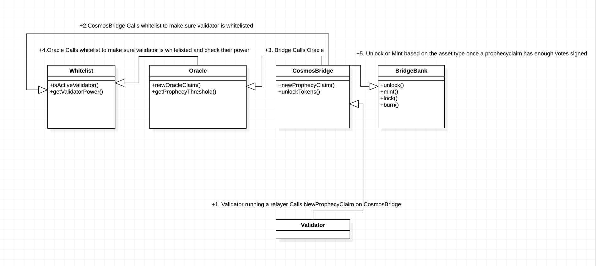

# This Document Will Walk through the 4 Different Peggy User Flows

1. Cosmos Native Asset being transferred to ethereum.
- A user sends a lock tx with the sifnoded specifying rowan as the token to lock up, the amount of tokens to send, and the desired ethereum address recipient. This TX emits a cosmos event with all of these data fields.
- A relayer has subscribed to these cosmos events and hears them. Upon hearing the event, the relayer takes all of those data fields of eth address, token amount and token type, and packages it into an ethereum transaction. This transaction gets submitted to the CosmosBridge contract by calling ```newProphecyClaim```. Other relayers do the same.
- Once enough relayers have signed off on the prophecyClaim in the CosmosBridge, the CosmosBridge calls the BridgeBank to mint new tokens for the intended recipient in the BridgeToken contract.


2. Ethereum Native Pegged Asset being transferred to ethereum.
- A user sends a burn tx with the sifnoded specifying ceth as the token to burn, the amount of tokens to send, and the desired ethereum address recipient. This TX emits a cosmos event with all of these data fields.
- A relayer has subscribed to these cosmos events and hears them. Upon hearing the event, the relayer takes all of those data fields of eth address, token amount and token type, and packages it into an ethereum transaction. This transaction gets submitted to the CosmosBridge contract by calling ```newProphecyClaim```. Other relayers do the same.
- Once enough relayers have signed off on the prophecyClaim in the CosmosBridge, the CosmosBridge calls the BridgeBank to unlock the eth for the intended recipient in the BridgeToken contract.

Both scenarios 1 and 2 can be summarized with this image.



Note that the next type of transactions require approving the BridgeBank contract to spend your tokens before calling either the lock or burn function. The only exception to this rule is ethereum, you do not need to call approve on ethereum, because it is not an ERC20 token.


3. Ethereum Native Asset on Ethereum Being Transferred to Sifchain
- A user sends a lock tx on ethereum to the BridgeBank contract specifying the token address, the amount of tokens to send, and the desired address of the sifchain recipient. This TX emits an ethereum event with all of these data fields.

```
event LogLock(
    address _from,
    bytes _to,
    address _token,
    string _symbol,
    uint256 _value,
    uint256 _nonce
);
```
- Relayers have subscribed to the BridgeBank smart contract, hear this transaction and package it up into a new Oracle Claim and submit the transaction to cosmos.
- Once enough relayers have signed off on this Oracle Claim on cosmos, then pegged assets are minted on cosmos to the recipient.


4. Cosmos Native Pegged Asset on Ethereum Being Transferred Back to Sifchain
- A user sends a burn tx on ethereum to the BridgeBank contract specifying the token address, the amount of tokens to send, and the desired address of the sifchain recipient. This TX emits an ethereum event with all of these data fields.
```
event LogBurn(
    address _from,
    bytes _to,
    address _token,
    string _symbol,
    uint256 _value,
    uint256 _nonce
);
```
- Relayers have subscribed to the BridgeBank smart contract, hear this transaction and package it up into a new Oracle Claim and submit the transaction to cosmos.
- Once enough relayers have signed off on this Oracle Claim on cosmos, then pegged assets are unlocked on cosmos and sent to the recipient.
