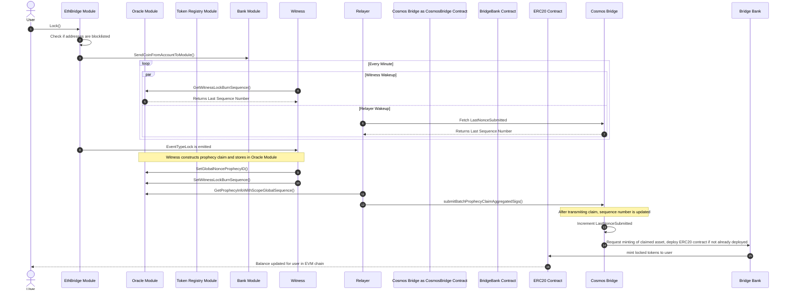
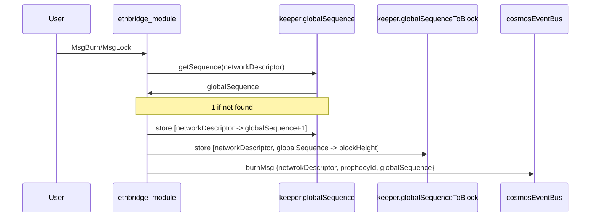
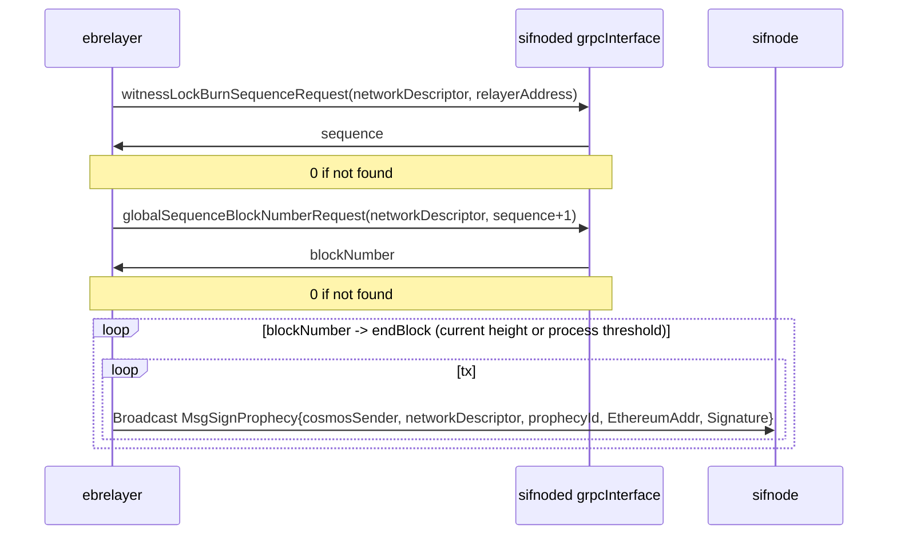
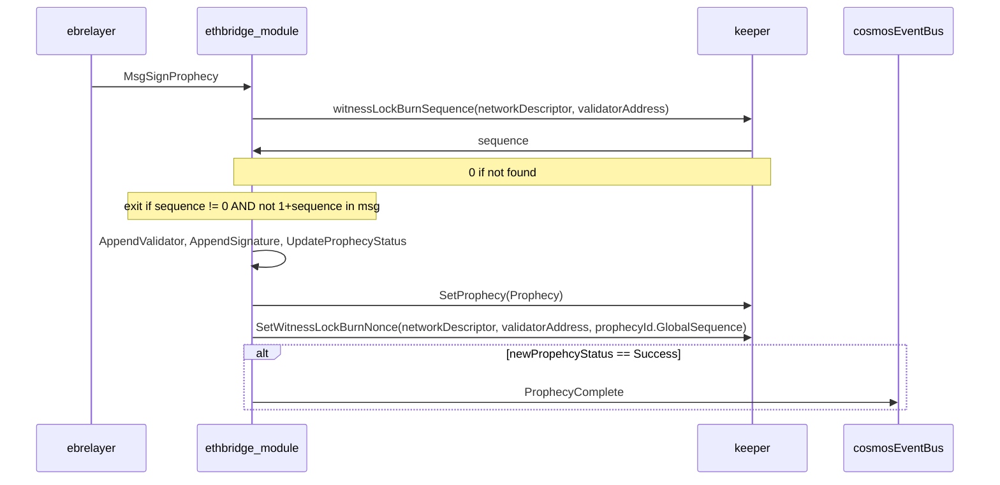
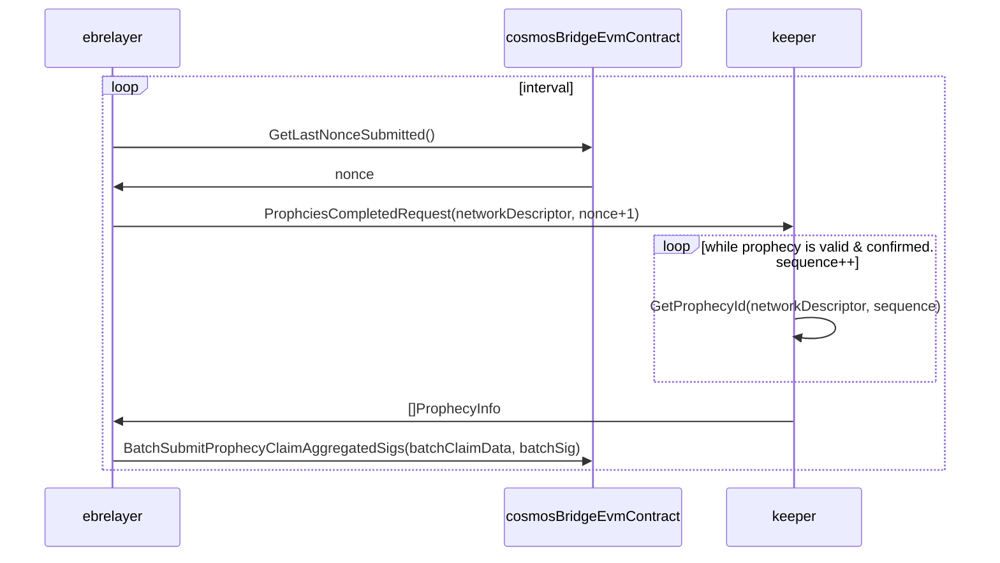

# Cosmos Export

## Cosmos Lock Sequence

Peggy 2.0 can Export Cosmos native assets (Rowan and IBC Assets)
out of the sifchain (cosmos) blockchain. It does this by locking cosmos native assets
tracked by the bank module and emits events which instruct the smart contract on the EVM chain called the [BridgeBank](SmartContracts#BridgeBank) to mint IOU's in the form of BridgeTokens representing the exported asset.
Once locked the peggy 2.0 mechanisms watching for EventTypeLock spring into action with the following sequences:


This is for moving Cosmos assets (either rowan or IBC tokens) from Sifnode to an external EVM chain.

When users initiate a lock on sifnode for Cosmos asset they want exported the following steps occur:

1. The user either mapped from the UI or direct in the cli specify the denomHash for the token to lock, the quantity to lock, and the address to export the tokens to.
2. The EthBridge Module verifies that both the users SifAddress and the address they are exporting to are not prohibited addresses by OFAC.
3. Sifnode pulls up the metadata on the denomhash specified. Sifnode gets the network descriptor it's exporting out to, verifies the
   [cross-chain fee](Concepts#crossChain) can be paid, credits the [cross-chain fee](Concepts#crossChain) account, then calls `transferCoinsFromAccountToModule` to lock the coins
   on the user's account for that denomHash at the quantities requested. Sifnode will then emit a new event of type [EventTypeLock](Events/EventTypeLock).
4. Every minute the witnesses (there are many) will wake up and query `GetWitnessLockBurnSequence()` from the oracle module in order to find the state that specific witness was last processing.
5. The oracle module returns the last LockBurnSequence number processed by that witness or `0` if there was no prior history for that witness.
6. Every minute the relayer (there is only one) will wake up and query `FetchLastNonceSubmitted()` from the CosmosBridge Smart Contract
7. The CosmosBridge smart contract returns the last sequence number that was completely processed by CosmosBridge.
8. Witnesses, while watching for events, observes an EventTypeLock and then begin to construct a prophecy claim.
9. Witness will then sign the prophecyID of the event with their EVM native keys and then send that signature along with the prophecy to the oracle module using `SetGlobalNonceProphecyID()`. See [Virtual Mem Pool](Concepts#virtualMem) for more details.
10. After the witness sends its signed prophecy to the Virtual MemPool it will increment its sequence number by calling `SetWitnessLockBurnSequence()`.
11. The relayer will fetch the state of the prophecy by calling `GetProphecyInfoWithScopeGlobalSequence` and when a relayer sees that m of n signatures are available from the witnesses, it will move onto the next step.
12. After a completed prophecy has been costructed the relayer makes a call to the `sumbitProphecyClaimAggregatedSigs()` function of the CosmosBridge contract.
13. After submitting the call to the EVM chain, the CosmosBridge will automatically increment the LastNonceSubmitted
14. Once the CosmosBridge verifies that the prophecy is complete and the signatures are valid, it will call the BrideBank and order it to mint the funds for the user.
15. BridgeBank will then instruct the ERC20 bridgeToken to mint funds for the user in the ammount specified by the prophecy.

## Fees
Anytime a user wants to export cosmos assets onto an EVM chain there are three tyes of fees that need to be accounted for, user incurred fees,  relayer incurred fees, and witness incurred fees.

### User Incurred Fees
When a user initates an export from sifchain they have to pay two fees, one is the sifchain gas fee in rowan for the transaction. The second is the EVM Native currency as a cross chain fee to cover the relayer costs to unlock funds from the bridgebank.

!> What is the average rowan gas cost to initiate this transaction?

At the time of writing this developers are expecting the average export from Ethereum would cost a user roughly $100 due to the crosschain fee.

### Witness Incurred Fees
When a witness sees a new transaction it has to store its signed prophecy into the virtual mempool as well as increment its sequence number on the sifchain blockchain. In order to perform these transactions it must pay rowan to cover the gas costs of these transactions.

!> What is the average rowan gas cost to initiate this transaction?

### Relayer Incurred Fees
When a relayer sees a signed and completed prophecy claim it will transmit this claim to the CosmosBridge on the EVM chain being exported to. This costs Gas in the native EVM chains currency to perform, the cross chain fee charged to the user should be close to the gas price being charged to the relayers.

## How to Initate a Cosmos Side lock
When a user wants to lock assets from the sifchain account to an EVM chain they should use the GUI however as a developer you may want to trigger burns with the CLI, that can be down with:

!> Why is the cross chain fee something we set here, also how does it know the Denom Hash of the Cross Chain Fee?

```bash
SIF_ACCOUNT="Sender Sif Account"
ETH_ACCOUNT="Destination EVM Account"
DENOMHASH="Denom Hash of asset being exported"
CROSS_CHAIN_FEE="The cross chain fee"
NETWORK_DESCRIPTOR="The EVM Network ID"
CHAIN_ID="THE Sifchain Network ID"

sifnoded tx ethbridge lock $SIF_ACCOUNT $ETH_ACCOUNT $DENOMHASH $CROSS_CHAIN_FEE --network-descriptor $NETWORK_DESCRIPTOR --gas-prices=0.5rowan --gas-adjustment=1.5 --chain-id $CHAIN_ID
```


## Sequences in cosmos export flow
We use sequences to keep track of tx that has been processed.

Variables

| Variable       | Key | Interface (TBD Naming) | Invariant | If not found |
| :------------- | :--------- | :--- | :------- | :-- |
| GlobalSequence | networkDescriptor | ethbridge.keeper | Stored value is 1+ what currently exists in pipeline | Returns 1 |
| globalSequenceToBlock | networkDescriptor, globalSequence | ethbridge.keeper | NA | Returns 0 |
| WitnessLockBurnSequence | networkdescriptor, ValidatorAddress | oracle.keeper | Stored value is last known globalSequence to have signed and saved a prophecy | Returns 0 |
| lastNonceSubmitted | NA | cosmosBridge.sol | The last processed global sequence  | NA |


#### Comsos module receiving lock/burn request


#### Witness flow
<!-- Ebrelayer cosmos witness -->
Peggy Witness node repeats the following flow at regular interval


<!-- TODO: Might not need to separate them, coz wanna show nonce in keeper -->

#### Cosmos Ethbridge module
<!-- Cosmos ethbrdige module SignProphecy msg handling-->



#### Relayer flow
<!-- TODO: Styling -->
Variables: nonce: globalSequence the contract has processed
