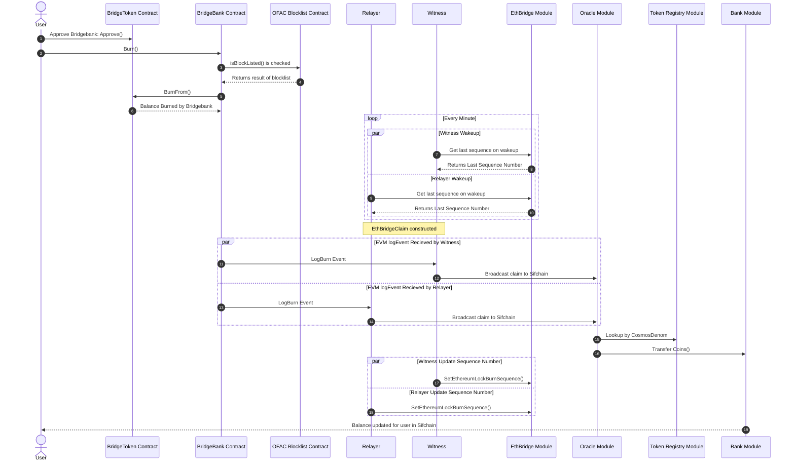

# Cosmos Import from EVM

## EVM Burn sequence

Peggy 2.0 can import Cosmos assets (Rowan and IBC tokens)
into the sifchain (cosmos) blockchain that have been [exported](Scenarios/evmExport) to an EVM chain. It does this by burning the
BridgeToken created during the inital export by the [BridgeBank](SmartContracts#BridgeBank). This process is very similar to the process performed by the [EVM Import](Scenarios/evmImport) with the main difference being a change from a lock to a burn call.
Once burned the peggy 2.0 mechanisms watching for LogBurn Events spring into action with the following sequences:



This is for moving Cosmos assets that have been exported to an EVM chain as BridgeTokens back into Sifchain.
Precondition: assets have been moved to EVM chain from Sifchain with a `lock` scenario.

1. User initiates the scenario by approving bridgebank on the BridgeToken contract by calling `approve()` with the bridgebank address for the balance they want to burn. This authorizes the bridgebank to burn their tokens.
2. User will call the `burn()` function on the [BridgeBank](SmartContracts#BridgeBank) smart contract, they will send the following paramaters for the burn:
   - `recipient`: byte representation of the sifchain address funds will be released to
   - `token`: address of the bridge token contract being burned
   - `amount`: uint256 value being burned by the bridgebank
3. Bridgebank will verify the user has enough funds for the requested burn, verify that the token being burned is in the `cosmosTokenWhiteList` and then burn the funds from the users account.
4. Bridgebank will call the OFAC blocklist and verify that the user is not prohibited by OFAC from doing business.
5. OFAC will return a boolean stating if the user is banned, if the user is prohibited the [BridgeBank](SmartContracts#BridgeBank) will revert the transaction. Otherwise it continues.
6. The ERC20 contract will transfer the balances out of the users account and credit it for the bridgebank.
7. The BridgeToken contract will transfer the balances out of the users account and mark it destroyed.
8. The witnesses and relayers are functionally identical on Cosmos imports from EVM. Since the witness is statless it will wake up every minute and query its last sequence number from the EthBridgeModule. It will call the GetEthereumLockBurnSequence method with the following paramaters:
   - `networkDescriptor`: An enum representing the network the witness is connected to.
   - `valAccount`: An address for the witness on sifchain
9. The EthBridgeModule will lookup and return to the witness the last sequence number that witness processed and if it has no history will return `0` as the current sequence number.
10. The relayer, being identical in Cosmos Imports from EVM mode will likewise wakeup every minute and query its last sequence number from the EthBridgeModule. It will call the `GetEthereumLockBurnSequence` method with the following paramaters:
    - `networkDescriptor`: An enum representing the network the relayer is connected to.
    - `valAccount`: An address for the relayer on sifchain
11. The EthBridgeModule will lookup and return to the relayer the last sequence number that relayer processed and if it has no history will return `0` as the current sequence number.
12. Upon completion of the `burn()` function the [BridgeBank](SmartContracts#BridgeBank) will emit a [LogBurn](Events#LogBurn) event on EVM network with the following data:
    - `_from`: Ethereum address that initiated the burn
    - `_to`: the sifchain address that the imported assets should be credited to (UTF-8 encoded string)
    - `_token`: the bridge token's contract address
    - `_value`: the quantity of asset being burned (a uint256 representing the smallest unit of the base value)
    - `_nonce`: the current transaction sequence number which is indexed as a topic (\_nonce) (this value increments automatically for each `burn`)
    - `_decimals`: the decimals of the bridge token which defaults to 6 if not found
    - `_networkDescriptor`: the network descriptor for the chain this asset is on
    - `_denom`: The cosmos denom of the IBC Asset or `rowan` for rowan.
13. Upon seeing the LogBurn event, [witnesses](Components#witness) will:
    - Set the \_denom as the denomHash in the new claim
    - create a [NewEthBridgeClaim](Events/NewEthBridgeClaim) and broadcast it to sifnode claim, and then broadcast the event to sifnode. The witnesses will then update the sequence number they stored for the last processed block.
14. The same as #12
15. Upon seeing the LogBurn event, [relayer](Components#relayer) will:
    - Set the \_denom as the denomHash in the new claim
    - create a [NewEthBridgeClaim](Events/NewEthBridgeClaim) and broadcast it to sifnode claim, and then broadcast the event to sifnode. The relayers will then update the sequence number they stored
16. When sifnode starts to process the [NewEthBridgeClaim](Events/NewEthbridgeClaim) the message handler for `CreateEthBridgeClaim` is called, during this it will:
    - Verify the sender of the claim is a valid Relayer/Witness
    - Verify the Claim Sequence number is properly ordered, (i.e. a claim is not being handled out of order)
    - Attempt to process the claim depending upon the number of already submitted claims from relayers/witnesses
    - Query the TokenRegistry using the cosmos Denom to get any necessary information. _Panic if no entry is found_.
17. When the [NewEthBridgeClaim](Event/NewEthbridgeClaim) message handler calls `ProcessClaim` it will return a status code
    of `oracletypes.StatusText` which will be checked to see if the claim status is `StatusText_STATUS_TEXT_SUCCESS` if it is the message handler will
    call `ProcessSuccessfulClaim` which will instruct the bank module to transfer coins from the ethbridge module to the users account for the denom and value of the claim.
18. After submitting the [NewEthBridgeClaim](Events/NewEthBridgeClaim) the [witnesses](Components#witness) will call `SetEthereumLockBurnSequence` in the
    `EthBridge Module` to update its state on the sifchain blockchain as having processed that claim.
19. After submitting the [NewEthBridgeClaim](Events/NewEthBridgeClaim) the [relayers](Components#relayer) will call `SetEthereumLockBurnSequence` in the
    `EthBridge Module` to update its state on the sifchain blockchain as having processed that claim.
20. Finally after sifchain successfully processes the successful claim it will emit a new event signaling the claim was processed successfully.

!> Currently Cosmos Events are transmitted in code for every EthBridgeClaim submitted, but we dont seem to have any events for when a successful claim is transmitted as step 17 calls for, is this in the code and/or needed/wanted?

## Fees

Anytime a user wants to import assets into sifchain there are two types of fees that need to be accounted for, user incurred fees and relayer/witness incurred fees.

### User Incurred Fees

The only fees a user will incur during an import of Cosmos assets stored on an EVM chain back into sifchain will be the EVM native gas fees for:

1. Calling `approve()` on the BridgeToken contract
2. Calling `Burn()` on the [BridgeBank](SmartContracts#BridgeBank) contract.

At the time of writing this developers are expecting the average import from Ethereum would cost a user roughly $40~$85.

### Witness/Relayer Incurred Fees

When a user initates an import each relayer and witness must submit a [NewEthBridgeClaim](Events/NewEthBridgeClaim) as well as a message to increment their sequence numbers to the
sifchain blockchain. These messages cost rowan to perform.

!> What is the average cost to a relayer/witness in rowan to perform these operations?

## How to programatically Initate a Burn

Below is a program which would query a users balance of a specific BridgeToken, and then initiate a burn for the entire
balance:

```typescript
import { ethers, BigNumberish } from "ethers";

const BridgeBankAddress = "BridgeBank address goes here";
const TokenAddress = "BridgeToken token you wish to import goes here";
const sifAddress = "SifAddress you are importing to";
const BridgeBankABI = {...}; /* BridgeBank ABI goes here */
const TokenABI = {...}; /* BridgeToken ABI goes here */
let balance: BigNumberish;
let bridgeBank: ethers.Contract;
let token: ethers.Contract;

async main() {

  try {
    /* Connect to the network and get access to the users signing keys */
    const provider = new ethers.getDefaultProvider()
    await provider.send("eth_requestAccounts", []);
    const signer = provider.getSigner();

    /* Create an object representing each contract we intend to interact with */
    bridgeBank = new ethers.Contract(
        BridgeBankAddress,
        BridgeBankABI,
        signer
    );
    token = new ethers.Contract(TokenAddress, TokenABI, signer);

    /* Query the balance so that we can approve the bridgebank as a spender */
    balance = await token.balanceOf(signer.getAddress());

  } catch (error) {
    console.error("Error connecting to EVM chain or finding smart contracts", error);
    return;
  }

  /* Approve the bridgebank as spender */
  try {
    const approvalTx = await token.approve(BridgeBankAddress, balance);
    await approvalTx.wait();
  } catch (error) {
    console.error("Error attempting to grant approval for bridgebank to burn tokens", error);
    return;
  }

  /* Burn users tokens so the sifchain import process starts */
  try {
    const sifAddressBytes = ethers.utils.toUtf8Bytes(sifAddress);
    const burnTx = await tokenbridgeBank.burn(
      sifAddressBytes,
      TokenAddress,
      balance
    );
    await burnTx.wait()
    return;
  } catch (error) {
    console.error("Error attempting to burn token to bridgebank", error);
    return;
  }
}

async()
  .then(() => console.log("Huzzah! The token burn has been initiated!"))
  .catch((error) => console.error("Boo, something went wrong ", error));
```
