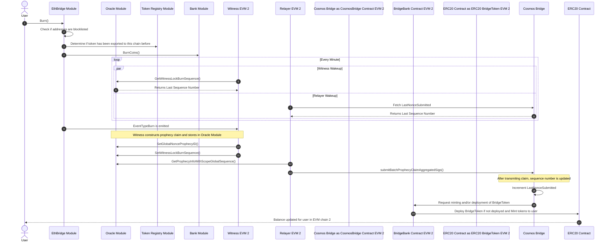

# Non-native EVM Export

## Cosmos Burn Sequence

Peggy 2.1 will be able to export EVM Native Assets (EVM Native Currency such as ETH and ERC20 tokens) from one EVM chain to another (e.g. Ethereum to Polygon) 
through the sifchain blockchain. It does this by burning EVM native assets from the first chain tracked by the bank module and emits events which instruct the smart contract on 
the secondary EVM chain called the [BridgeBank](SmartContracts#BridgeBank) to release mint funds for an IOU known as a bridgeToken. Once burned the peggy 2.0 mechanisms watching for Burn Events spring
into action with the following sequences:

Preconditions:
- There was a [lock](#Lock) operation on the token on the native chain and its been creditied to the users sifchain account
- User has the EVM native currency on their sifchain account for the secondary EVM chain to pay the cross chain fee



Steps:
1. User initiates a burn operation with sifnoded (either from UI or via CLI), specifying:
   - The source sifnode address
   - The destination EVM address
   - The denom hash of the currency  
   - Amount of currency/tokens to be transferred
   ```
   @todo@ sifnoded ... (include the actual command)
   ```
1. [`sifnoded`](Components#Sifnoded) invokes GetTokenMetadata(denomHash) in the Token Registry module to get the token
   metadata. From the obtained metadata, it identifies the network to export to.
    - It sees that the network descriptor is not the token's native network - @TODO@ Is this the key difference from "plain" burn?
    - It calls the token metadata module (@TODO@ Which function) to determine if the token has been exported to that network before
      - If not, it uses the "first time export fee" which is higher because it has to cover smart contract creation on the target network.
        @TODO@ Describe how/where is this fee calculated
      - If yes, it uses the standard cross-chain fee @TODO@ Describe how/where is this fee calculated 
1. sifnoded verifies that the fee can be paid and credits the cross-chain fee account for the fee amount.
1. sifnoded burns the tokens in the user's account for the given `denomHash` and `amount`. @TODO@ more details needed
1. sifnoded emits event of type [EventTypeBurn](Events#EventTypeBurn) with the following data:
    - `prophecyId`: @TODO@ How is it calculated?
    - @TODO@   
1. When witnesses see event of type `EventTypeBurn`, they will
    - sign the prophecyId of the event with their own EVM native private key
    - broadcast the event back to sifnoded (@TODO@ how?)
1. When a relayer (which is listening to events on sifchain) sees the signed event coming from a witness, it will check
   the signature. After seeing at least `m` of `n` valid signatures (@TODO@ how are `m` and `n` set?) for the same
   prophecyID, but signed with different keys, it will call a `submitProphecyClaimAggregatedSigs()` @TODO@ parameters
   function on target chain's [CosmosBridge][SmartContracts#CosmosBridge] smart contract. @TODO@ What happens if the signature is invalid, or if a long time passes? Where are they stored in the meantime and for how long? 
1. Next, the relayer will increment the sequence number of sifnode side. (@TODO@ How? Potential bottleneck?)
1. The `CosmosBridge` smart contract will [verify that the signatures are valid](SmartContracts#verifySignature).
    - If not all signatures are valid, it will ignore it 
    - If the signature is valid, it will mint the bridge token representing the asset. (@TODO@ more details needed - we're potentially doing it the first time etc.)
    - The value of `cosmosDenom` in the token will be set to `denomHash` from originating chain 
    - The corresponding amount will be sent to the user's target ETH address.

(@TODO - not clear what this means) When a user burns the asset, it follows the same flow as burning an IBC bridgetoken on the EVM side, but
instead of being credited as an IBC token, it's restored as a standard imported EVM asset.

This is for moving EVM-native assets (either EVM native currency or ERC20 tokens) from Sifnode to their originating EVM chain.
Precondition: assets have been moved to Sifnode with a `lock` scenario.

When users initiate a burn on sifnode for either the native asset or a token on the EVM chain, they export out to the
following steps:

1. The user either mapped from the UI or direct in the cli specify the denom for the token to burn, the quantity to burn, the address to export the tokens to, and the network descriptor they wish to export to.
2. The EthBridge Module verifies that both the users SifAddress and the address they are exporting to are not prohibited addresses by OFAC.
3. Sifnode pulls up the metadata on the denom hash specified. Sifnode gets the network descriptor it's exporting out to, queries the token registry to determine if the token has
   been exported to this network before, if yes it sets the standard corss-chain fee, if not it sets the deploy cross-chain fee.
4. verifies the [cross-chain fee](Concepts#crossChain) can be paid, credits the [cross-chain fee](Concepts#crossChain) account, then burns the coins
   on the user's account for that denomHash at the quantities requested. Sifnode will then emit a new event of type [EventTypeBurn)(Events/EventTypeBurn).
5. Every minute the witnesses (there are many) will wake up and query `GetWitnessLockBurnSequence()` from the oracle module in order to find the state that specific witness was last processing.
6. The oracle module returns the last LockBurnSequence number processed by that witness or `0` if there was no prior history for that witness.
7. Every minute the relayer (there is only one) will wake up and query `FetchLastNonceSubmitted()` from the CosmosBridge Smart Contract
8. The CosmosBridge smart contract returns the last sequence number that was completely processed by CosmosBridge.
9.  Witnesses, while watching for events, observes an EventTypeBurn and then begin to construct a prophecy claim.
10. Witness they will sign the prophecyID of the event with their EVM native keys and then send that signature along with the prophecy to the oracle module using `SetGlobalNonceProphecyID()`. See [Virtual Mem Pool](Concepts#virtualMem) for more details.
11. After the witness sends its signed prophecy to the Virtual MemPool
12. The relayer will fetch the state of the prophecy by calling `GetProphecyInfoWithScopeGlobalSequence` and when a relayer sees that m of n signatures are available from the witnesses, it will move onto the next step.
13. After a completed prophecy has been costructed the relayer makes a call to the sumbitProphecyClaimAggregatedSigs function of the CosmosBridge contract.
14. After submitting the call to the EVM chain, the CosmosBridge will automatically increment the LastNonceSubmitted
15. Once the CosmosBridge verifies that the prophecy is complete and the signatures are valid, it will call the BrideBank and request the deploy and or minting of funds for the user.
16. BridgeBank will determine if the contract has been deployed for this bridgeToken, if not it will deploy one. After the check for the ERC20 bridgetoken deployment the bridgebank will mint tokens for the user.
17. The users balance for the bridgetoken on EVM2 will be updated to reflect what they exported.

## Fees
Anytime a user wants to export imported assets onto an EVM chain there are three tyes of fees that need to be accounted for, user incurred fees,  relayer incurred fees, and witness incurred fees.

### User Incurred Fees
When a user initates an export from sifchain they have to pay two fees, one is the sifchain gas fee in rowan for the transaction. The second is the EVM Native currency as a cross chain fee to cover the relayer costs to unlock funds from the bridgebank. 
Unique to a non-native export is:
 - The cross-chain fee will be paid in the native chains currency to which its being exported
 - There are two cross-chain fees, one for the first time export as the bridgeToken has to be delpoyed, and one for every other export.

!> What is the average rowan gas cost to initiate this transaction? Are the below estimates correct as well?

Currently it is estimated by the developers that it would cost roughly:
 - Ethereum: $1,000 first time export, $100 standard export
 - Polygon: $0.25 first time export, $0.01 standard export
 - Binance: $6 first time export, $0.20 standard export

### Witness Incurred Fees
When a witness sees a new transaction it has to store its signed prophecy into the virtual mempool as well as increment its sequence number on the sifchain blockchain. In order to perform these transactions it must pay rowan to cover the gas costs of these transactions. 

!> What is the average rowan gas cost to initiate this transaction?

### Relayer Incurred Fees
When a relayer sees a signed and completed prophecy claim it will transmit this claim to the CosmosBridge on the EVM chain being exported to. This costs Gas in the native EVM chains currency to perform, the cross chain fee charged to the user should be close to the gas price being charged to the relayers. 

## How to Initate a Cosmos Side Burn
When a user wants to burn assets from the sifchain account to a non-native EVM chain they should use the GUI however as a developer you may want to trigger burns with the CLI, that can be down with:

The cross-chain fee set here is what is consumed, it must be equal to or greater then the constant value set in sifnode.

```bash
SIF_ACCOUNT="Sender Sif Account"
ETH_ACCOUNT="Destination EVM Account"
DENOMHASH="Denom Hash of asset being exported"
CROSS_CHAIN_FEE="The cross chain fee"
NETWORK_DESCRIPTOR="The EVM 2 Network ID"
CHAIN_ID="THE Sifchain Network ID"

sifnoded tx ethbridge burn $SIF_ACCOUNT $ETH_ACCOUNT $DENOMHASH $CROSS_CHAIN_FEE --network-descriptor $NETWORK_DESCRIPTOR --gas-prices=0.5rowan --gas-adjustment=1.5 --chain-id $CHAIN_ID
```