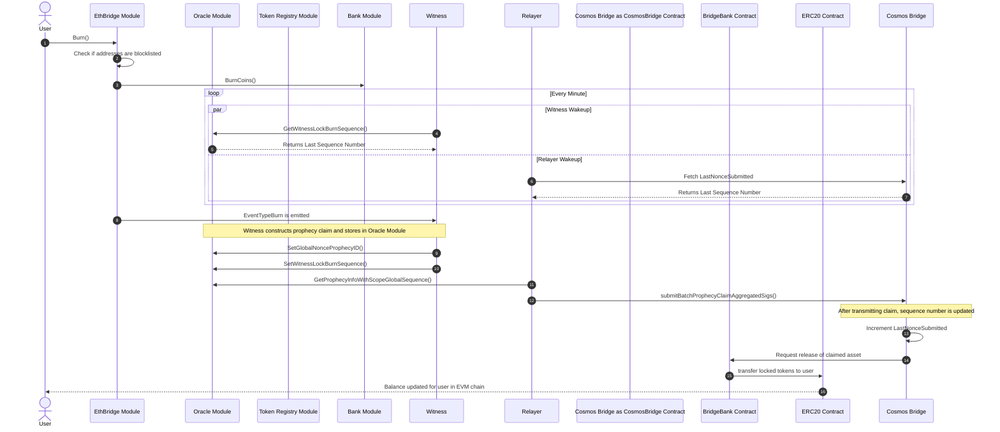

# EVM Export

## Cosmos Burn Sequence

Peggy 2.0 can Export EVM native assets (EVM Native Currency such as ETH and ERC20 tokens) 
out of the sifchain (cosmos) blockchain. It does this by burning EVM native assets
tracked by the bank module and emitting events that instruct the smart contract on the EVM chain called the [BridgeBank](SmartContracts#BridgeBank) to release the funds for. 
Once burned, the Peggy 2.0 mechanisms watching for Burn Events spring into action with the following sequences:


This is for moving EVM-native assets (either EVM native currency or ERC20 tokens) from Sifnode to their originating EVM chain.
Precondition: assets have been moved to Sifnode with a `lock` scenario.

When users initiate a burn on sifnode for either the native asset or a token on the EVM chain, they export out to the
following steps:

1. The user either mapped from the UI or direct in the cli specify the denomHash for the token to burn, the quantity to burn, and the address to export the tokens to.
2. The EthBridge Module verifies that both the users SifAddress and the address they are exporting to are not prohibited addresses by OFAC.
3. Sifnode pulls up the metadata on the denom hash specified. Sifnode gets the network descriptor it's exporting out to, verifies the 
   [cross-chain fee](Concepts#crossChain) can be paid, credits the [cross-chain fee](Concepts#crossChain) account, then burns the coins
   on the user's account for that denomHash at the quantities requested. Sifnode will then emit a new event of type [EventTypeBurn)(Events/EventTypeBurn).
4. Every minute, the witnesses (there are many) will wake up and query `GetWitnessLockBurnSequence()` from the oracle module in order to find the state that specific witness was last processing.
5. The oracle module returns the last LockBurnSequence number processed by that witness or `0` if there was no prior history for that witness.
6. Every minute, the relayer (there is only one) will wake up and query `FetchLastNonceSubmitted()` from the CosmosBridge Smart Contract
7. The CosmosBridge smart contract returns the last sequence number that was completely processed by CosmosBridge.
8. Witnesses, while watching for events, observe an EventTypeBurn and then begin to construct a prophecy claim.
9. Witness they will sign the prophecyID of the event with their EVM native keys and then send that signature along with the prophecy to the oracle module using `SetGlobalNonceProphecyID()`. See [Virtual Mem Pool](Concepts#virtualMem) for more details.
10. After the witness sends its signed prophecy to the Virtual MemPool
11. The relayer will fetch the state of the prophecy by calling `GetProphecyInfoWithScopeGlobalSequence` and when a relayer sees that m of n signatures are available from the witnesses, it will move onto the next step.
12. After a completed prophecy has been constructed, the relayer makes a call to the sumbitProphecyClaimAggregatedSigs function of the CosmosBridge contract.
13. After submitting the call to the EVM chain, the CosmosBridge will automatically increment the LastNonceSubmitted
14. Once the CosmosBridge verifies that the prophecy is complete and the signatures are valid, it will call the BrideBank and unlock the funds for the user.
15. BridgeBank either transfers the EVM native currency or calls the ERC20 contract being transferred to transfer the funds to the user.

## Fees
Anytime a user wants to export imported assets onto an EVM chain, there are three types of fees that need to be accounted for, user incurred fees,  relayer incurred fees, and witness incurred fees.

### User Incurred Fees
When a user initiates an export from sifchain, they have to pay two fees; one is the sifchain gas fee in rowan for the transaction. The second is the EVM Native currency as a cross-chain fee to cover the relayer costs to unlock funds from the bridgebank. 

!> What is the average rowan gas cost to initiate this transaction?

Costs for exporting assets from sifchain to ethereum are set by a flat cross-chain fee picked by an administrator of the network.

### Witness Incurred Fees
When a witness sees a new transaction, it has to store its signed prophecy into the virtual mempool as well as increment its sequence number on the sifchain blockchain. In order to perform these transactions, it must pay rowan to cover the gas costs of these transactions. 

!> What is the average rowan gas cost to initiate this transaction?

### Relayer Incurred Fees
When a relayer sees a signed and completed prophecy claim, it will transmit this claim to the CosmosBridge on the EVM chain being exported to. This costs Gas in the native EVM chains currency to perform; the cross-chain fee charged to the user should be close to the gas price being charged to the relayers. 

## How to Initiate a Cosmos Side Burn
When a user wants to burn assets from the sifchain account to an EVM chain, they should use the GUI however; as a developer, you may want to trigger burns with the CLI, that can be down with:


```bash
SIF_ACCOUNT="Sender Sif Account"
ETH_ACCOUNT="Destination EVM Account"
DENOMHASH="Denom Hash of asset being exported"
CROSS_CHAIN_FEE="The cross chain fee"
NETWORK_DESCRIPTOR="The EVM Network ID"
CHAIN_ID="THE Sifchain Network ID"

sifnoded tx ethbridge burn $SIF_ACCOUNT $ETH_ACCOUNT $DENOMHASH $CROSS_CHAIN_FEE --network-descriptor $NETWORK_DESCRIPTOR --gas-prices=0.5rowan --gas-adjustment=1.5 --chain-id $CHAIN_ID
```