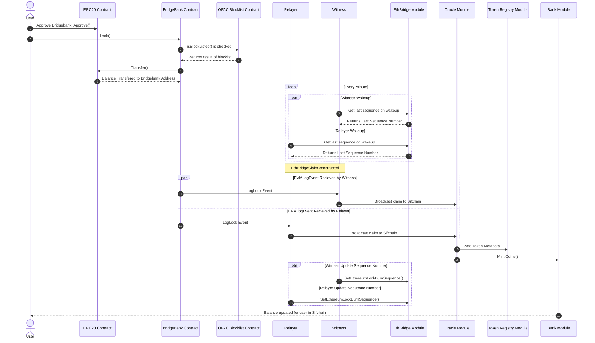
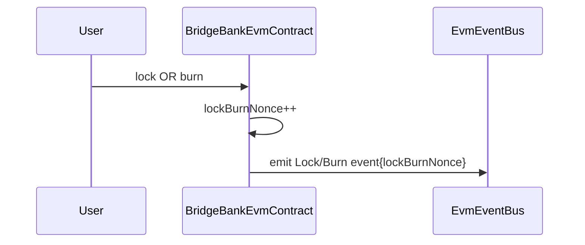
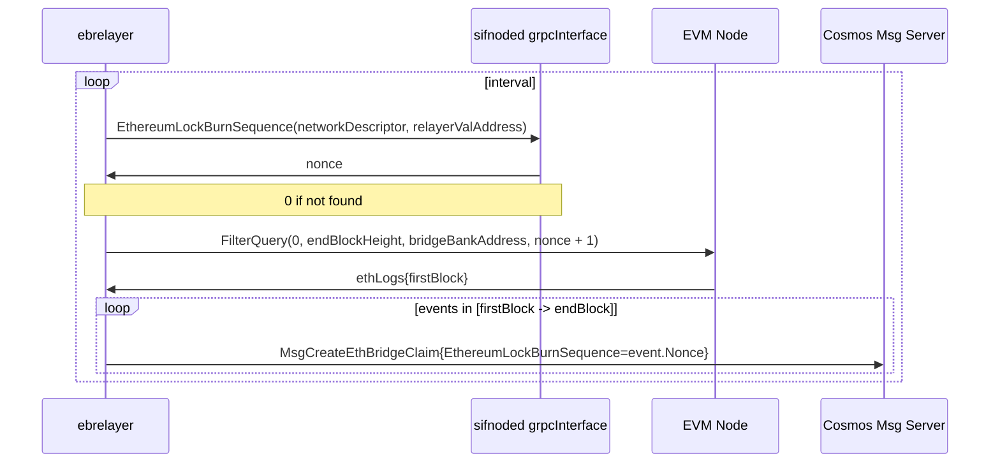
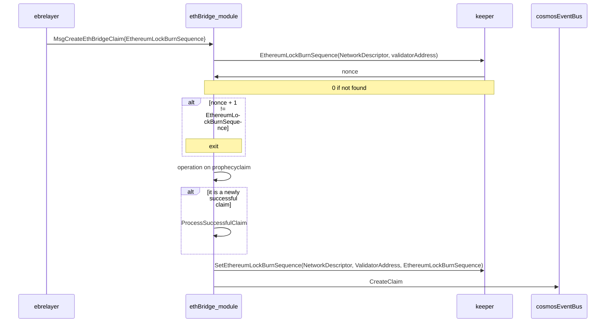

# EVM Import
## EVM Lock sequence
Peggy 2.0 can import EVM native assets (EVM Native Currency such as ETH and ERC20 tokens)
into the sifchain (cosmos) blockchain. It does this by locking EVM native assets
into a solidity smart contract on the EVM chain called the [BridgeBank](SmartContracts#BridgeBank).
Once locked the peggy 2.0 mechanisms watching for LogLock Events spring into action with the following sequences:


This is for moving EVM-native assets (either EVM native currency or ERC20 tokens) from EVM chain to Sifchain.

1. User initiates the scenario by approving bridgebank on the ERC20 contract by calling `approve()` with the bridgebank address for the balance they want to lock. This authorizes the bridgebank to transfer their tokens when they lock the funds.
2. User will call the `lock()` function on the [BridgeBank](SmartContracts#BridgeBank) smart contract, they will send the following paramaters for the lock:
   - `recipient`: byte representation of the sifchain address funds will be released to
   - `token`: address of the token contract being locked, 0x0 for native EVM currency
   - `amount`: uint256 value being locked by the bridgebank
3. Bridgebank will verify the user has enough funds for the requested lock, verify the user is not attempting to lock a token on the `CosmosTokenWhiteList`, and then transfer the funds from the users account to the bridgebank contract.
4. Bridgebank will call the OFAC blocklist and verify that the user is not prohibited by OFAC from doing business.
5. OFAC will return a boolean stating if the user is banned, if the user is prohibited the [BridgeBank](SmartContracts#BridgeBank) will revert the transaction. Otherwise it continues.
6. The ERC20 contract will transfer the balances out of the users account and credit it for the bridgebank.
7. The witnesses and relayers are functionally identical on EVM imports. Since the witness is statless it will wake up every minute and query its last sequence number from the EthBridgeModule. It will call the GetEthereumLockBurnSequence method with the following paramaters:
   - `networkDescriptor`: An enum representing the network the witness is connected to.
   - `valAccount`: An address for the witness on sifchain
8. The EthBridgeModule will lookup and return to the witness the last sequence number that witness processed and if it has no history will return `0` as the current sequence number.
9. The relayer, being identical in EVM import mode will likewise wakeup every minute and query its last sequence number from the EthBridgeModule.  It will call the GetEthereumLockBurnSequence method with the following paramaters:
   - `networkDescriptor`: An enum representing the network the relayer is connected to.
   - `valAccount`: An address for the relayer on sifchain
10. The EthBridgeModule will lookup and return to the relayer the last sequence number that relayer processed and if it has no history will return `0` as the current sequence number.
11. Upon completion of the `lock()` function the [BridgeBank](SmartContracts#BridgeBank) will emit a [LogLock](Events#LogLock) event on EVM network with the following data:
     - `_from`: Ethereum address that initiated the lock
     - `_to`: the sifchain address that the imported assets should be credited to (UTF-8 encoded string)
     - `_token`: the token's contract address or the null address for EVM-native currency
     - `_value`: the quantity of asset being transferred (a uint256 representing the smallest unit of the base value)
     - `_nonce`: the current transaction sequence number which is indexed as a topic (_nonce) (this value increments automatically for each `lock`) (Referred to as Sequence Number in this documentation)
     - `_decimals`: the decimals of the asset which defaults to 18 if not found
     - `_symbol`: the symbol of the asset which defaults to empty string if not found
     - `_name`: the name of the asset which defaults to empty string if not found (_name)
     - `_networkDescriptor`: the network descriptor for the chain this asset is on
12. Upon seeing the LogLock event, [witnesses](Components#witness) will:
     - [calculate the denom hash](Concepts?id=token-denom-hashing-for-evm-native-assets)
     - create a [NewEthBridgeClaim](Events/NewEthBridgeClaim) and broadcast it to sifnode claim, and then broadcast the event to sifnode. The witnesses will then update the sequence number they stored
for the last processed block.
13. The same as #11
14. Upon seeing the LogLock event, [relayer](Components#relayer) will:
      - [calculate the denom hash](Concepts?id=token-denom-hashing-for-evm-native-assets)
      - create a [NewEthBridgeClaim](Events/NewEthBridgeClaim) and broadcast it to sifnode claim, and then broadcast the event to sifnode. The relayers will then update the sequence number they stored
15. When sifnode starts to process the [NewEthBridgeClaim](Events/NewEthbridgeClaim) the message handler for `CreateEthBridgeClaim` is called, during this it will:
      - Verify the sender of the claim is a valid Relayer/Witness
      - Verify the Claim Sequence number is properly ordered, (i.e. a claim is not being handled out of order)
      - Attempt to process the claim depending upon the number of already submitted claims from relayers/witnesses
      - Query the TokenRegistry for metadata on the EVM native asset and determine if it needs to be stored. If no metadata exists the
        TokenRegistry keeper method `AddTokenMetadata` will be called, storing all metadata from the claim.
16. When the [NewEthBridgeClaim](Event/NewEthbridgeClaim) message handler calls `ProcessClaim` it will return a status code
    of `oracletypes.StatusText` which will be checked to see if the claim status is `StatusText_STATUS_TEXT_SUCCESS` if it is the message handler will
    call `ProcessSuccessfulClaim` which will instruct the bank module to mint new coins for the denom and value of the claim.
17. After submitting the [NewEthBridgeClaim](Events/NewEthBridgeClaim) the [witnesses](Components#witness) will call `SetEthereumLockBurnSequence` in the
    `EthBridge Module` to update its state on the sifchain blockchain as having processed that claim.
18. After submitting the [NewEthBridgeClaim](Events/NewEthBridgeClaim) the [relayers](Components#relayer) will call `SetEthereumLockBurnSequence` in the
    `EthBridge Module` to update its state on the sifchain blockchain as having processed that claim.
19. Finally after sifchain successfully processes the successful claim it will emit a new event signaling the claim was processed successfully.

!> Currently Cosmos Events are transmitted in code for every EthBridgeClaim submitted, but we dont seem to have any events for when a successful claim is transmitted as step 17 calls for, is this in the code and/or needed/wanted?

## Fees
Anytime a user wants to import assets into sifchain there are two types of fees that need to be accounted for, user incurred fees and relayer/witness incurred fees.

### User Incurred Fees
The only fees a user will incur during an import into sifchain will be the EVM native gas fees for:

1. Calling `approve()` on an ERC20 contract if the asset they intend to import is an ERC20 contract
2. Calling `Lock()` on the [BridgeBank](SmartContracts#BridgeBank) contract.

At the time of writing this developers are expecting the average import on Ethereum would cost a user roughly $40~$85.

### Witness/Relayer Incurred Fees
When a user initates an import each relayer and witness must submit a [NewEthBridgeClaim](Events/NewEthBridgeClaim) as well as a message to increment their sequence numbers to the
sifchain blockchain. These messages cost rowan to perform.

!> What is the average cost to a relayer/witness in rowan to perform these operations?

## How to programatically Initate a Lock
Below is a program which would query a users balance of a specific ERC20 token, and then initiate a lock for the entire
balance:
```typescript
import { ethers, BigNumberish } from "ethers";

const BridgeBankAddress = "BridgeBank address goes here";
const TokenAddress = "ERC20 token you wish to import goes here";
const sifAddress = "SifAddress you are importing to";
const BridgeBankABI = {...}; /* BridgeBank ABI goes here */
const TokenABI = {...}; /* ERC20 Token ABI goes here */
let balance: BigNumberish;
let bridgeBank: ethers.Contract;
let token: ethers.Contract;

async main() {

  try {
    /* Connect to the network and get access to the users signing keys */
    const provider = new ethers.getDefaultProvider()
    await provider.send("eth_requestAccounts", []);
    const signer = provider.getSigner();

    /* Create an object representing each contract we intend to interact with */
    bridgeBank = new ethers.Contract(
        BridgeBankAddress,
        BridgeBankABI,
        signer
    );
    token = new ethers.Contract(TokenAddress, TokenABI, signer);

    /* Query the balance so that we can approve the bridgebank as a spender */
    balance = await token.balanceOf(signer.getAddress());

  } catch (error) {
    console.error("Error connecting to EVM chain or finding smart contracts", error);
    return;
  }

  /* Approve the bridgebank as spender */
  try {
    const approvalTx = await token.approve(BridgeBankAddress, balance);
    await approvalTx.wait();
  } catch (error) {
    console.error("Error attempting to grant approval for bridgebank to lock tokens", error);
    return;
  }

  /* Lock users tokens so the sifchain import process starts */
  try {
    const sifAddressBytes = ethers.utils.toUtf8Bytes(sifAddress);
    const lockTx = await tokenbridgeBank.lock(
      sifAddressBytes,
      TokenAddress,
      balance
    );
    await lockTx.wait()
    return;
  } catch (error) {
    console.error("Error attempting to lock token to bridgebank", error);
    return;
  }
}

async()
  .then(() => console.log("Huzzah! The token lock has been initiated!"))
  .catch((error) => console.error("Boo, something went wrong ", error));
```


## Sequences in ethereum import flow

Variables

| Variable       | Key | Interface (TBD Naming) | Invariant | If not found |
| :------------- | :--------- | :--- | :------- | :-- |
| EthereumLockBurnSequence | NetworkDescriptor, ValidatorAddress | ethbridge.keeper | Stored value is the lockBurnNonce of last completed ethbridgeclaim | 0 |
| lockBurnNonce | NA | BridgeBank.sol | Stored value is equal to latest emitted event | NA |

#### Ethereum Contract



#### Ethereum Relayer



#### Ethbridge module
Note here we will proceed to operate on prophecy claim iff EthereumLockBurnSequence is 1+ nonce stored in keeper

