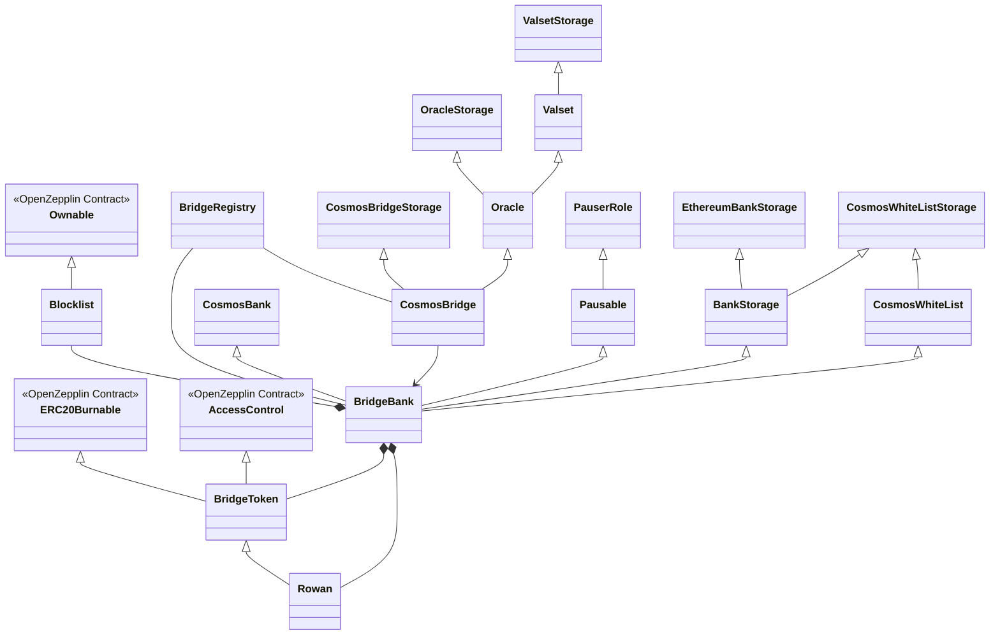
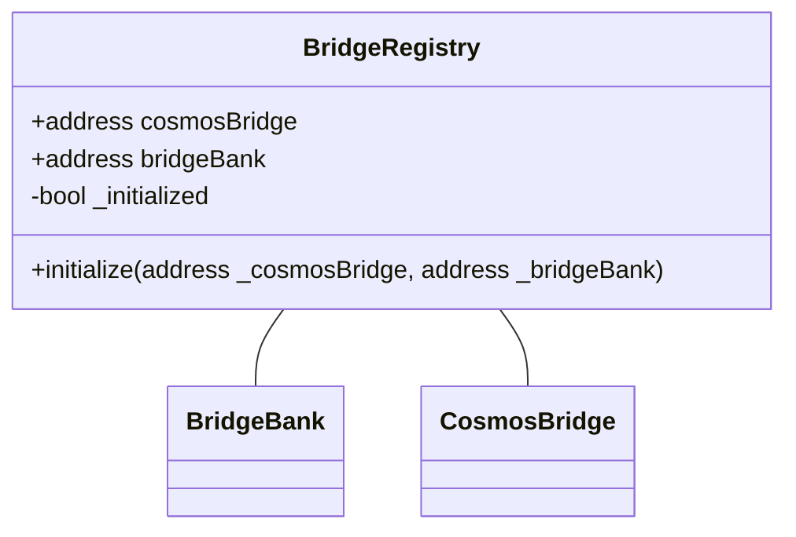
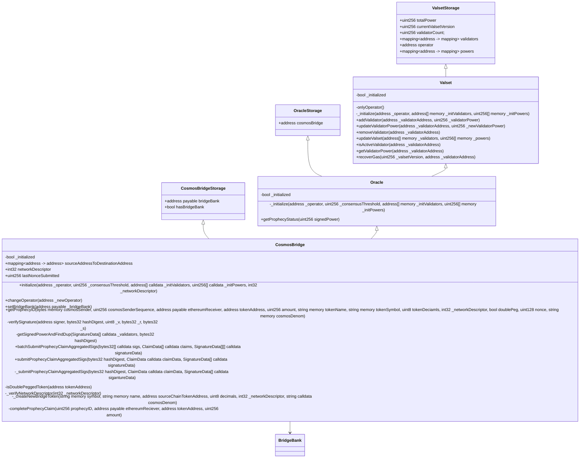
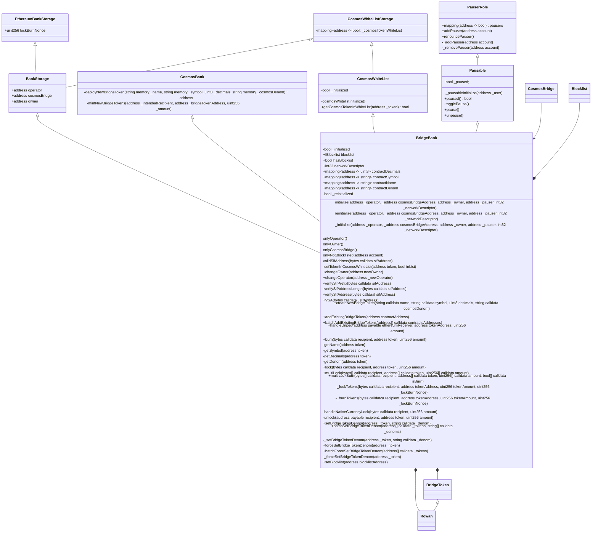
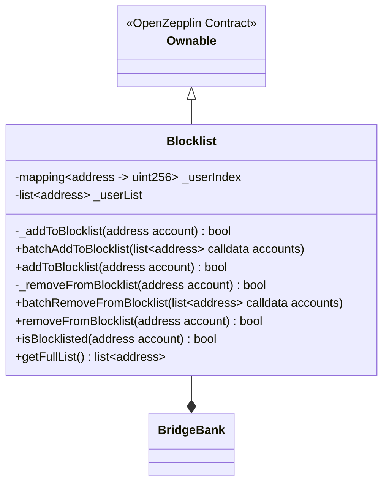

# Smart Contracts



In order for Sifchain to import and export tokens and EVM native currency between chains on EVM networks a series of smart contracts
have been developed to lock and burn funds as well as transmit relevant events to witnesses/relayers. These contracts are what hold 
on-chain tokens/currencies while they are being traded on Sifchain and other cosmos-based chains. 

## BridgeRegistry

The Bridge Registry is a simple contract that stores the addresses of the currently deployed CosmosBridge and BridgeBank smart contracts, and it holds no other purpose. This is an upgradable contract that can be 
updated if the contract addresses need to be changed in the future.

## CosmosBridge


The Cosmos Bridge smart contract is responsible for processing prophecy claims and communicating with the BridgeBank smart contract to unlock locked user funds. This contract is interacted with by the
relayer, which is responsible for relaying unlock/mint instructions from sifchain to an EVM chain. The smart contract will allow operators to be able to approve new validators and set their validator power.
This contract is responsible for tracking the current sequence number that has been sent from sifchain to the EVM chain this contract is deployed on. This contract supports batched transactions.

The operator set during initialization and reconfigurable via the `changeOperator(address _newOperator)` is the key that is capable of adding or removing new witnesses (validators) to the set of valid
witnesses. 

The important functions of note are:

### Submit Prophecy Claims
```solidity
batchSubmitProphecyClaimAggregatedSigs(bytes32[] calldata sigs, ClaimData[] calldata claims, SignatureData[][] calldata signatureData)
submitProphecyClaimAggregatedSigs(bytes32 hashDigest, ClaimData calldata claimData, SignatureData[] calldata signatureData)
```
These functions are what relayers will call to transmit a completed prophecy claim after it has received sign-off from a sufficient number of witnesses. Each witness that observes a sifchain
event will sign their prophecy claim and submit it to the sifchain virtual memory pool. A relayer watching the virtual memory pool will be able to submit any completed prophecy claims it observes
as well as batch submit any claims if there is a backlog. This function will inspect the prophecy claim and then verify that the claim has been correctly signed and has enough validator power
to complete the prophecy. If the prophecy has not reached the power threshold, the transaction will revert; otherwise the Cosmos Bridge will transmit instructions to the bridge bank to release or 
mint funds. 

### Adding Witnesses / Removing Witnesses
In the cosmos bridge smart contract, the term validator is in reference to witnesses who observe sifchain events. The methods which provide adding and removing validators are inherited from the Valset contract. Consensus threshold is set during the initialization of the CosmosBridge as an integer percent that must be reached i.e., 67 for 67% etc, and each validator is given a validator power value which can make one validator more powerful than another as the calculation for consensus is totalPower * consensusThreshold.
```solidity
addValidator(address _validatorAddress, uint256 _validatorPower)
```
The `addValidator` method is only callable by the holder of the operator account and will add the validators key to the set of valid witness keys along with setting that specific witness's voting power and increasing the total voting power variables. If every validator holds the same validatorPower, then increasing the number of validators will increase the number of witnesses that must sign off on each prophecy. 

```solidity
updateValidatorPower(address _validatorAddress, uint256 _newValidatorPower)
```
The `updateValidatorPower` method is only callable by the holder of the operator account and will change the current witness's validator power along with updating the total validator power values to reflect the change. 

```solidity
removeValidator(address _validatorAddress)
```
The `removeValidator` method is only callable by the holder of the operator account and will remove a validator key from the set of valid witness keys along with reducing the total 
validator power by the amount that specific validator held.

```solidity
updateValset(address[] memory _validators, uint256[] memory _powers)
```
The `updateValset` method is only callable by the holder of the operator account and will replace the entire validator set with a new set of validators/witnesses. This method takes an array of addresses held by the witnesses along with a matching array of uint256's representing the validator power for the address of the same index.

## BridgeBank

The heart of the sifchain import-export smart contracts is the Bridge Bank smart contract which is responsible for locking and burning user funds for import into sifchain. This contract receives direct calls from users to import tokens and EVM native currency into sifchain as well as processes requests from tho cosmosBridge to release users' funds. This contract supports batched transactions which will directly reduce the users gas costs when importing assets into sifchain.

### Permissions
The BridgeBank smart contract has several different permissioned roles, which are identified below:
 - Owner: An account that can add existing bridge tokens and change bridge token denoms, 
 - Operator: An account that can re-initialize the BridgeBank and specify the Blocklist Contract
 - CosmosBridge: A contract address that is trusted to properly process Prophecy Claims
 - NotBlocklisted: Any account that has not been restricted by OFAC, checks against external blocklist contract
 - Pauser: An account that can pause/unpause the bridgebank, reserved for emergencies to protect customer funds

### Importing Assets
EVM native currency (e.g., Ethereum), ERC20 tokens, exported IBC assets, and double pegged assets can all be imported into sifchain through the bridgebank smart contract. Depending upon the type of asset, either a lock operation or a burn operation is necessary. If the asset is native to the EVM chain (i.e., native currency or native erc20 token), then it will be locked to the bridgebank, if the asset is non-native (i.e., it was exported from sifchain) be that an IBC asset, Rowan, or a double pegged asset then it will be burned. Both operations will result in the asset being made available into sifchain after a 50 block waiting period. 

?>Before importing any BridgeToken, Rowan, or any other ERC20 tokens, a user must first approve bridgebank as a spender for the tokens they plan to import. No such requirement is needed for the native currency of a chain.

```solidity
  lock(bytes calldata recipient, address token, uint256 amount)
  multiLock(bytes[] calldata recipient, address[] calldata token, uint256[] calldata amount)
```
Users are able to call a lock on a single asset or multiple assets with the `lock` and `multiLock` method calls. A lock call expects a recipient, which is a valid sifchain address for the import
to go to, a token address of what is being imported (this is the null address for EVM native currency), and a value to transfer. If the user has a sufficient balance in all the tokens requested for transfer, the lock will occur starting the import process; otherwise, it will revert.


```solidity
  burn(bytes calldata recipient, address token, uint256 amount)
  multiLockBurn(bytes[] calldata recipient, address[] calldata token, uint256[] calldata amount, bool[] calldata isBurn)
```
Users are able to call burn on a single asset or multiple assets with the `burn` and `multiLockBurn` method calls. A burn expects a recipient, which is a valid sifchain address for the import to go to, a bridge token address of what is being imported, and a value to transfer. If the user has a sufficient balance in all tokens requested for transfer, the burn will occur starting the import process; otherwise, it will revert.

The method `multiLockBurn` is special in that it has an additional field which is an array of booleans of `isBurn` type; this method can lock EVM native currency, lock ERC20 tokens, and burn BridgeTokens in a single transaction call. 

## BridgeToken
```mermaid
classDiagram

  %% Openzepplin Contracts
    class ERC20Burnable {
    <<OpenZepplin Contract>>
  }
  class AccessControl {
    <<OpenZepplin Contract>>
  }


  
  %% BridgeToken Contracts
  class BridgeToken {
    -uint8 _decimals
    +string cosmosDenom
    constructor(string memory _name, string memory _symbol, uint8 _tokenDecimals, string memory _cosmosDenom)
    +mint(address user, uint256 amount)
    +decimals() uint8
    +setDenom(string calldata denom) bool
  }
  class Rowan {
    +BridgeToken erowan
    constructor(string memory _name, string memory _symbol, uint8 _tokenDecimals, string memory _cosmosDenom, address 
    _erowanAddress)
    +migrate()
  }

  %% BridgeBank Inherits
  BridgeBank *-- BridgeToken
  BridgeBank *--Rowan

  %% Rowan Inherits
  BridgeToken <|-- Rowan

  %% BridgeToken Inherits
  ERC20Burnable <|-- BridgeToken
  AccessControl <|-- BridgeToken


  %% Openzepplin Links
  link ERC20Burnable "https://docs.openzeppelin.com/contracts/3.x/api/token/erc20#ERC20Burnable" "Openzepplin Docs"
  link AccessControl "https://docs.openzeppelin.com/contracts/3.x/api/access#AccessControl" "Openzepplin Docs"
```


Bridge Tokens are Open Zepplin ERC20Burnable Tokens that represent Cosmos Native Assets and Double Pegged Assets. Rowan is a unique ERC20 token instance as Rowan was started as an 
Ethereum ERC20 token natively then imported into being a cosmos native token.

?>Unlike most smart contracts in the Sifchain ecosystem, Bridgetokens are **NOT UPGRADEABLE** and instead are fixed to the version deployed by the bridge.

### Access Control Roles
Sifchain Bridge Tokens use the OpenZeppelin Access Controls contract to enforce two role types on the contract. These roles are as follows:
- MINTER_ROLE: This is an address that can call the external mint function to mint new bridge tokens for users, it is set to the contract address of the Bridge Bank
- DEFAULT_ADMIN_ROLE: This is an address that can change the `cosmosDenom` of a specific Bridge Token, it is set to the contract address of the Bridge Bank

### Denom Types
Bridge Tokens have a custom field of `cosmosDenom` that is set on deployment in the constructor. This denom represents the internal sifchain address for the underlying asset. For Rowan this field will be `rowan` for cosmos native assets this field will be a string representing the symbol of the token being exported (e.g. `juno`). For double pegged EVM assets see [Token Denom Hashing](/Concepts?id=token-denom-hashing-for-evm-native-assets) for more information on the denom representation.

<!-- ## OFAC Blocklist


In order to comply with OFAC sanctions and to prevent Sifchain's DEX from being used for illegal purposes, Sifchain has deployed a separate contract called the Blocklist, this contract contains an array, and mapping of OFAC sanctioned EVM addresses which our smart contracts will query before processing a request. By storing each blocked address in both a mapping and an array we are able to quickly search if any address is currently blocked in O(1) time while also being able to query the entire set of blocked addresses for comparison during updates. If any request comes in from a prohibited address, the smart contracts will automatically reject the transaction. Every 24 hours, Sifchain runs a script against the OFAC website listing sanctioned addresses, extracts the EVM addresses from the document, queries all the addresses in the smart contract and then removes any addresses removed from the OFAC list and adds any new addresses not currently in the list to the list. This process is done in five parts:
1. The script calls `getFullList`, which returns an array of all addresses currently blocked by the blocklist
2. The script queries the OFAC website and extracts all valid EVM addresses
3. The script identifies any addresses that are currently being blocked that are not on the OFAC blocklist and identifies any addresses that are not on the blocklist that are currently on the OFAC website
4. The script calls `removeFromBlocklist` or `batchRemoveFromBlocklist` with the list of addresses that need to be removed from the blocklist
5. The script calls `addToBlocklist` or `batchAddtoBlocklist` with the list of addresses that need to be added to the blocklist -->