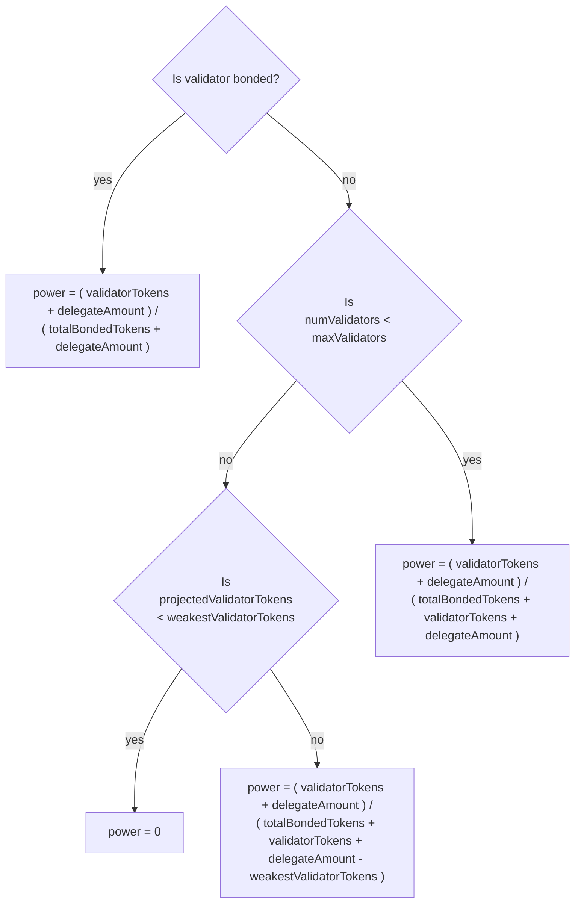

# Min commission

The min commission-rate feature is intended to prevent validators charging a commission below
a hard-coded threshold, `minCommission` (currently 5%).
There are three elements to enforcing the min commission:

1. Ensuring that validators cannot be created with a `commission-rate` below 5%. This is achieved by blocking
`MsgCreateValidator` messages with a `commission-rate` < `minCommission`.
2. Ensuring that validators cannot edit their configuration to set the `commission-rate` to less than 5%. This is achieved by blocking
`MsgEditValidator` messages with a `commission-rate` < `minCommission`.
3. Ensuring that all current validators have their `commission-rate` set to at least 5%. This is
achieved with an upgrade handler on the release which introduces the min commission feature.

NOTE: There is no blocking of `MsgDelegate` and `MsgBeginRedelegate` messages to prevent attempts to
delegate/redelegate to validator's with a `commission-rate` below `minCommision` since such validators
cannot exist due to the enforcement steps outlined above.

This tutorial demonstrates these three components working on a localnet.

## Prep

1. Initialize the chain then start a node

```
make init
make run
```

## Create Validator

This section demonstrate the limitation on `MsgCreateValidator`.

### Success

#### Explicit commission-rate

If the `commission-rate` is set above 5% creating a validator succeeds.

1. Query the list of validators and confirm there is currently one validator `sif_val`

```
sifnoded query staking validators
```

2. Create a `akasha_val` validator:

```
sifnoded tx staking create-validator \
  --amount=92000000000000000000000stake \
  --pubkey='{"@type":"/cosmos.crypto.ed25519.PubKey","key":"+uo5x4+nFiCBt2MuhVwT5XeMfj6ttkjY/JC6WyHb+rE="}' \
  --moniker="akasha_val" \
  --chain-id=localnet \
  --commission-rate="0.10" \
  --commission-max-rate="0.20" \
  --commission-max-change-rate="0.1" \
  --min-self-delegation="1000000" \
  --from=akasha \
  --keyring-backend=test \
  --broadcast-mode block \
  -y
```

NOTE: The pubkey used in this example was found by running the `sifnoded tendermint show-validator` command
on a different localnet instance.

NOTe: Each validator must have a unique public key.

2. Query the list of validators and confirm that `akasha_val` has been added and there are now two validators:

```
sifnoded query staking validators
```

### Failure

Attempting to create a validator with a `commission-rate` below 5% fails (even if the max rate > 5%).

1. Attempt to create an a validator but with a 3% commission rate (this would have succeeded if the commission-rate had been set > 5%):

```
sifnoded tx staking create-validator \
  --amount=92000000000000000000000stake \
  --pubkey='{"@type":"/cosmos.crypto.ed25519.PubKey","key":"/7LUsFhIdP0jj36wToOwY3zWC75YXxVd1vxp7YAc1Gs="}' \
  --moniker="alice_fail_val" \
  --chain-id=localnet \
  --commission-rate="0.03" \
  --commission-max-rate="0.20" \
  --commission-max-change-rate="0.01" \
  --min-self-delegation="1000000" \
  --from=alice \
  --keyring-backend=test \
  --broadcast-mode block \
  -y
```

Which fails with the message `validator commission 0.030000000000000000 cannot be lower than minimum of 0.050000000000000000: invalid request`

## Edit Validator

This section demonstrates the limitations on `MsgEditValidator` edit validator.

### Success

If editing the `commission-rate` to a value above 5% the edit succeeds.

1. The commission rate can only be updated once within 24hrs, so wait 24 hrs then edit the `akasha_val` validator to set the commission-rate to 7%:

```
sifnoded tx staking edit-validator \
  --from=akasha \
  --commission-rate="0.07" \
  --chain-id=localnet \
  --keyring-backend=test \
  --broadcast-mode block \
  -y
```

2. Query the validators and observe the `akasha_val` validator's `commission-rate` is now 7%

```
sifnoded query staking validators --output=json  | jq '.validators[] | select(.description.moniker=="akasha_val").commission.commission_rates.rate'
```

### Failure

1. Attempt to set the commission to 3%:

```
sifnoded tx staking edit-validator \
  --from=akasha \
  --commission-rate="0.03" \
  --chain-id=localnet \
  --keyring-backend=test \
  --broadcast-mode block \
  -y
```

Which fails with the message `validator commission 0.030000000000000000 cannot be lower than minimum of 0.050000000000000000: invalid request`


# Min commission upgrade handler

Demonstrating the upgrade handler, will require running the previous release then upgrading to the
release which introduces the min-commission feature. It also requires that there's a validator
pre the upgrade with a `commission-rate` below `minCommission`.

1. Checkout the previous release

```
git checkout v0.13.5
```

2. Initialize the chain

```
make init
```

3. Decrease the governance voting period time before first start:

```
echo "$(jq '.app_state.gov.voting_params.voting_period = "60s"' $HOME/.sifnoded/config/genesis.json)" > $HOME/.sifnoded/config/genesis.json
```

4. Set validator `commission-rate` to 3% and `max-commission-rate` to 4%

NOTE: The `commission-rate` of the validator could be set to 3% in the `scripts/init.sh` script. This
however causes the chain to fail to start on newer versions of the code which have the new min-commission feature.

```
sed -i 's/"rate": "0.100000000000000000",/"rate": "0.030000000000000000",/g' $HOME/.sifnoded/config/genesis.json
sed -i 's/"max_rate": "0.200000000000000000",/"max_rate": "0.040000000000000000",/g' $HOME/.sifnoded/config/genesis.json
```

5. Start the chain

```
make run
```

6. Query the commission and observe that the rate is 3% and the max is 4%

```
sifnoded query staking validators --output=json | jq .validators[0].commission.commission_rates
```

7. Raise an upgrade proposal:

```
sifnoded tx gov submit-proposal software-upgrade 0.13.6 \
  --from sif \
  --deposit 10000000000000000000stake \
  --upgrade-height 30 \
  --upgrade-info '{"binaries":{"linux/amd64":"url_with_checksum"}}' \
  --title test_release \
  --description "Test Release" \
  --keyring-backend test \
  --chain-id localnet \
  --broadcast-mode block \
  --fees 100000000000000000rowan \
  -y
```

8. Vote on proposal:

```
sifnoded tx gov vote 1 yes --from sif --chain-id localnet --keyring-backend test -y --broadcast-mode block
```

The node will have a consensus failure when it reaches the `upgrade-height` set in the upgrade proposal.
Hit `ctrl-c` to kill the stuck node.

9. Checkout the release with the min-commission upgrade handler:

```
git checkout v0.13.6
```

10. Run the release:

```
make run
```

11. Query the commission and observe that the rate is 5% and the max is 5%:

```
sifnoded query staking validators --output=json | jq .validators[0].commission.commission_rates
```

# Max Voting Power

The max voting power feature is intended to prevent delegating or re-delegating to validators with
more than a hard coded threshold voting power (currently 10%). This is done by blocking `MsgDelegate` and
`MsgBeginRedelegate` messages which would give the targeted validator more than 10% of the voting power. The
voting power is defined as the amount of token delegated to the validator as a fraction of the total **bonded** tokens.
Where bonded tokens are tokens delegated to validators which are in the validator set. This is inline with how
voting power is defined generally in the SDK (see https://github.com/cosmos/cosmos-sdk/blob/d0043914ba7c37c3a0d7039d2c2a2aca6b38a93b/x/staking/types/validator.go#L350-L356) and on Mintscan (https://www.mintscan.io/sifchain/validators - the cumulative share of the validators in
the validator set (115 validators) add up to 100%, so validators outside the validator set (Mintscan shows there are 315
validators in total at the time of writing) have 0% voting power).

The amount of voting power the targeted validator would acquire if the delegation succeeded, called the
projected voting power, depends on a number of factors. The following flow chart describes how the projected
voting power is calculated:



This tutorial demonstrates the max voting power restriction in action on four scenarios corresponding to the four projected voting power
calculations in the flow chart

## Validator Bonded

### Success

### Failure

## Validator not Bonded & numValidators < maxValidators

### Success

### Failure

## Validator not Bonded & numValidators > maxValidators & projectedValidatorTokens < weakestValidatorTokens

### Success

### Failure

Not possible

## Validator not Bonded & numValidators == maxValidators & projectedValidatorTokens > weakestValidatorTokens

### Success
### Failure
