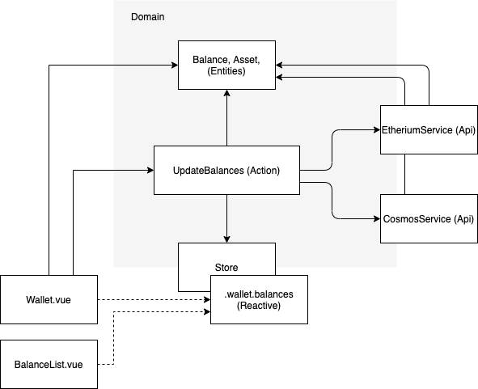
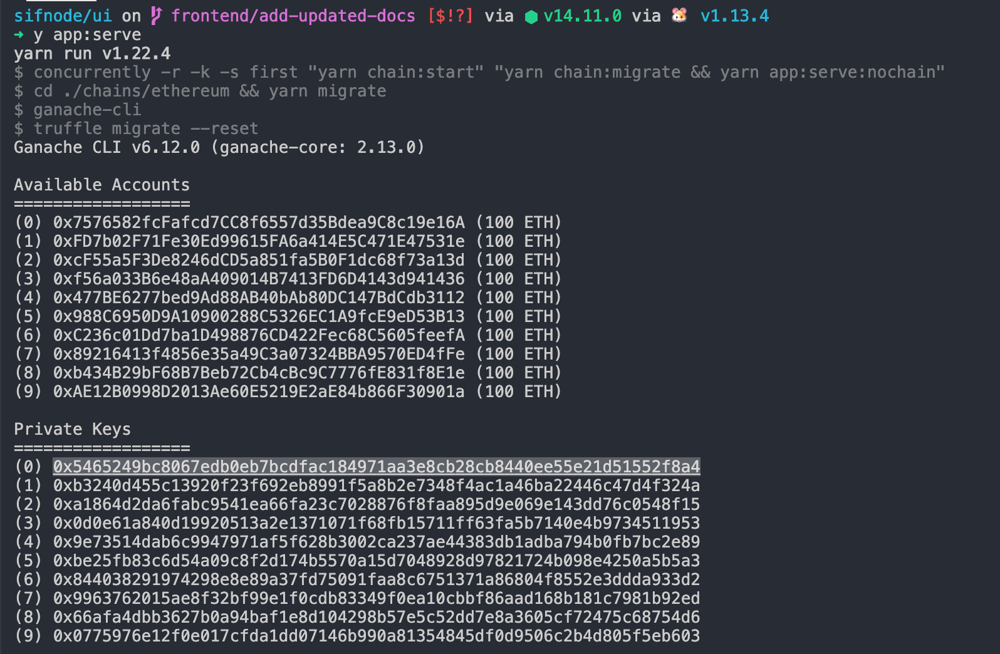
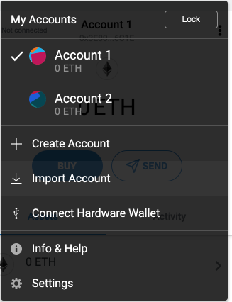
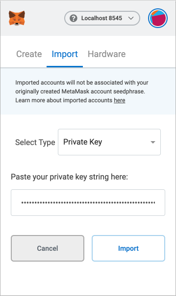

# Frontend repo

🚧 This is currently under construction and may not work. 🚧

## Installation

### Prerequisites

- [Go 1.15](https://golang.org/doc/install) (to build the sifchain to test against)
- [Node 14](https://nodejs.org/en/) we recommend using [nvm](https://github.com/nvm-sh/nvm)
- [Yarn Classic](https://classic.yarnpkg.com/en/docs/install#mac-stable)
- [Docker](https://docs.docker.com/get-docker/) for your environment setup to run without sudo
- A linux like environment (macOs,linux,WSL)

### Setup

1. Install the base sifnode repo in your go directory: `~/go/src/github.com/Sifchain/sifnode`
1. `cd ./ui` - To work on the frontend UI
1. `yarn` - Install dependencies
1. `yarn build` - Build the blockchains to test against

NOTE: If you are using VSCode you should use the code-workspace at `./ui/SifnodeUI.code-workspace` to ensure that Vetur works correctly.

### Launching locally

There are a few ways you can launch the project stack locally. Most of the time working on frontend you will probably just want to use:

```
yarn stack
```

NOTE: This command requires [tmux](https://github.com/tmux/tmux/wiki/Installing)

### Run unit and integration tests in core

`yarn test`

### Run App and Core tests

| Command                | Description                                                |
| ---------------------- | ---------------------------------------------------------- |
| `yarn test`            | Alias for `core:test:all`                                  |
| `yarn build`           | Build core, all chains and the frontend app                |
| `yarn app:serve:all`   | Serve frontend app with the background blockchains         |
| `yarn core:test:all`   | Run tests on `core` module with the background blockchains |
| `yarn chain:start:all` | Start the background blockchains                           |

## Having more control

| Command              | Description                                                   |
| -------------------- | ------------------------------------------------------------- |
| `yarn chain:eth`     | Start the background ethereum blockchain                      |
| `yarn chain:sif`     | Start the background sifnode blockchain                       |
| `yarn chain:migrate` | Migrate the background blockchain must have the chain started |
| `yarn app:serve`     | Serve frontend app with no background chain                   |
| `yarn core:test`     | Run core tests with no background chain                       |
| `yarn core:watch`    | Compile core code in watch mode                               |

## Folder structure

| Path               | Description                      |
| ------------------ | -------------------------------- |
| `./app`            | A Vue interface that uses core.  |
| `./chains`         | Blockchain projects for testing. |
| `./core`           | All business functionality.      |
| `./e2e`            | End to end tests.                |
| `./docs`           | Documentation.                   |
| `./docs/decisions` | Architectural decisions.         |

## Architecture

We are following architecture influenced by clean architecture.

https://blog.cleancoder.com/uncle-bob/2012/08/13/the-clean-architecture.html



_Example action/service dependencies_

The main premise here is that we have a domain consisting of **actions** and **entities** which communicate with the outside world over `api` and `store` channels.

| Section         | Description                                                                                                   |
| --------------- | ------------------------------------------------------------------------------------------------------------- |
| `core/actions`  | Actions, (aka usecases, interactors, commands) These hold the business logic and policies for the application |
| `core/entities` | Application data types.                                                                                       |
| `core/api`      | Input/output services. This is where you write and read data to wallets remote endpoints, rpc etc.            |
| `core/store`    | Shared reactive state between the `actions` and the view                                                      |
| `app`           | View application that renders UI                                                                              |

Every part of this system is designed to facilitate easy testing.

## Testing

### End to end tests

`yarn pw:test:stack`

Will serve the built webapplication in `app/dist` on port 5000 and run tests over this including backing services which are then reset every test.

`yarn pw:test:debug`

Will run tests in debug mode over a website served on http://localhost:8080. This is good for testing a feature you are working on. Ideally when working on a feature you might want to do the following in separate terminals:

1. `yarn stack:backend` - start up the backing services
2. `yarn app:serve` - start up the web server
3. `yarn core:watch` - update the webserver with core code on change
4. `yarn pw:test:debug` - Run the test suite over the stack - you probably want to isolate the test you need with `.only` methods.

### To update instant stack

If you need to update the instant stack image:

1. Make changes to migrate scripts
1. run `./scripts/run-stack-save-default-snapshot.sh`
1. run `./scripts/build-stack-backend-docker.sh`
1. Check in the changes to the local repo.

Note you will need to ensure you have [logged into the github container registry](https://docs.github.com/en/packages/working-with-a-github-packages-registry/working-with-the-container-registry#authenticating-to-the-container-registry) and have write access to the `/sifchain/sifnode` namespace.

### Testing Actions

Actions can be grouped arbitrarily by domain aggregate and may have their dependencies injected using the supplied creator. You ask for your api and store keys by using the given TS types.

```ts
// Generic params specify what API the service expects
type ActionContext<ServiceKeys, StoreKeys>
```

```ts
export default function createAction({
  api,
  store,
}: ActionContext<"WalletService" | "SifService", "WalletStore">) {
  return {
    async disconnectWallet() {
      await api.WalletService.disconnect();
      store.WalletStore.isConnected = false;
      store.WalletStore.balances = [];
      await api.SifService.disconnect();
    },
  };
}
```

The reason we do it this way is that in testing we only need to give the action creator exactly what it needs.

```ts
const actions = createAction({ api: { WalletService: fakeWalletService } });

// Then under test the wallet service runs with it's dependencies
actions.disconnectWallet();
```

### Testing Blockchain Driven Api

In the same way that Actions have their dependencies injected we can inject dependencies to our services layer.

```ts
export default function createFooService(context: FooServiceContext) {
  return {
    async doStuff() {
      const provider = await context.getWeb3Provider();
      // ...
    },
  };
}
```

### Etherium based blockchain development.

To test our blockchain backed apps we use ganache-cli and truffle to create a local etherium chain that is migrated to contain a couple of fake tokens.

You can find the token contracts [here](../chains/eth/contracts).

Our API setup asks for getters to supply environment information. It may make sense to convert this to a function that returns a config object we inject everywhere.

To test manually run the app using serve which includes ganache running in the background

```bash
./ui> yarn app:serve:all
```

> Alternatively you can run the following processes in separate terminals:
>
> 1. `yarn chain:eth` - Will run ganache
> 1. `yarn chain:sif` - Will run a built sifnode
> 1. `yarn chain:migrate` - Will run migrations against the running blockchains then exit
> 1. `yarn app:serve` - Will run the Vue app

From the terminal window running ganache make note of the first private key that gets generated:



Then fire up the app on http://localhost:8080/.

Go to metamask. Click on the right corner menu and select "Import Account"



Paste your private key there and you will load up your account on metamask.



Hit import and select this account. Be sure to have this account selected. Reload the page click the connect wallet button and run through the procedure to connect your wallet in metamask.

You should see the balances of your wallet in the application.

### Component Library

To view and develop components in isolation you can use Storybook.

```
yarn storybook
```

### Testing stores

Stores are created using factory functions so that their state can be set upon creation. The store is the state our view responds to. It makes sense to test the actions and resultant store effects together as a usecase as we require no further dependencies. We can supply stores to actions in a similar way to the way we supply apis.

### Testing Views

Testing views is not as important as testing core code so we can defer to e2e testing for that. That is why it is ok to share configured action and store instances with Vue components. However complex render functionality or computed properties should be contained within stores or render actions.
